# ADAgentAI Unified Technical Specification

**Version:** 1.0.0
**Date:** 2026-01-24
**Status:** Draft

---

## Table of Contents

1. [Overview](#1-overview)
2. [Architecture](#2-architecture)
3. [Data Transformation Layer](#3-data-transformation-layer)
4. [User Journeys](#4-user-journeys)
5. [LangGraph Implementation](#5-langgraph-implementation)
   - 5.1 [Graph State](#51-graph-state)
   - 5.2 [Human-in-the-Loop with interrupt()](#52-human-in-the-loop-with-interrupt)
   - 5.3 [Resume with Command](#53-resume-with-command)
   - 5.4 [Dynamic Tool Selection with Runtime Context](#54-dynamic-tool-selection-with-runtime-context)
   - 5.5 [Graph Builder](#55-graph-builder)
   - 5.6 [Middleware & Progress Events](#56-middleware--progress-events)
   - 5.7 [State Persistence & Memory Tiers](#57-state-persistence--memory-tiers)
   - 5.8 [Loop Control & Stop Policy](#58-loop-control--stop-policy)
   - 5.9 [FastMCP Server Implementation](#59-fastmcp-server-implementation)
     - 5.9.1 [Network Credential Models](#591-network-credential-models)
     - 5.9.2 [JIT Credential Injection](#592-jit-credential-injection-with-dependencies)
     - 5.9.3 [Tool Annotations](#593-tool-annotations-for-approval-system)
     - 5.9.4 [Dynamic Tool Visibility](#594-dynamic-tool-visibility)
     - 5.9.5 [Background Tasks with Progress](#595-background-tasks-with-progress)
     - 5.9.6 [Built-in Middleware Stack](#596-built-in-middleware-stack)
     - 5.9.7 [Complete Server Setup](#597-complete-server-setup)
6. [LangSmith Testing & Evaluation](#6-langsmith-testing--evaluation)
7. [Multi-Tenancy & Agency Support](#7-multi-tenancy--agency-support)
8. [Provider & Context Settings](#8-provider--context-settings)
9. [Security & Compliance](#9-security--compliance)
10. [Acceptance Criteria](#10-acceptance-criteria)
11. [Reference Mapping](#11-reference-mapping)

---

## 1. Overview

### 1.1 Purpose

ADAgentAI is an AI-powered assistant for managing advertising operations across 9 ad networks through natural language. This specification unifies:

- **Agent Architecture** (from `claude_idea.md`)
- **Data Transformation** (from `logic_mapping.md`)
- **User Journeys** (from `user_journey_2026-01-24.md`)

### 1.2 Problem Statement

| Challenge | Scale | Solution |
|-----------|-------|----------|
| Tool overload | 283 tools across 9 networks | Two-layer semantic routing |
| Schema fragmentation | Each network uses different terminology | Pydantic Bidirectional Adapters |
| Multi-step workflows | Complex operations require validation | Workflow Path + Precondition checks |
| Write safety | Destructive actions need human approval | LangGraph interrupt() pattern |
| Multi-tenancy | Agencies manage multiple client accounts | Organization-scoped providers |

### 1.3 Networks Supported

| Network | Tools | Auth Type | Capabilities |
|---------|-------|-----------|--------------|
| AdMob | 19 | Google OAuth | Mediation, Reporting, Apps, Ad Units |
| Ad Manager | 154 | Google OAuth | Orders, LineItems, Targeting, Content |
| AppLovin | 20 | API Key | Waterfall, Experiments, Reports |
| Unity | 24 | Service Account | Mediation Groups, Placements |
| Mintegral | 12 | API Key | Apps, Placements, Reports |
| Liftoff | 10 | API Key | Apps, Placements, Reports |
| InMobi | 11 | API Key | Apps, Placements, Reports |
| Pangle | 11 | API Key | Apps, Ad Slots, Reports |
| DT Exchange | 22 | API Key | Apps, Placements, Instances |

**Source:** `backend/mcp_servers/providers/` (9 provider modules)

---

## 2. Architecture

### 2.1 System Overview

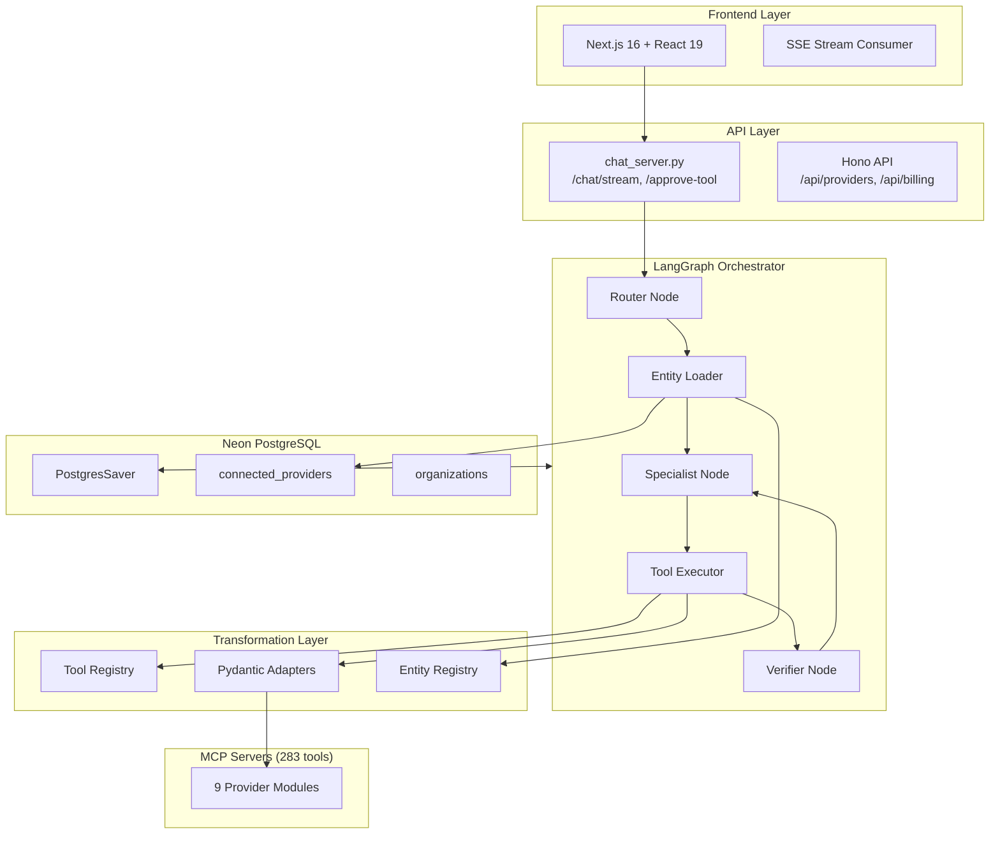

**Source:** `claude_idea.md` (System Architecture Overview)

### 2.2 Dual-Path Routing

The router classifies queries and selects an execution path + model:

| Path | Model | Trigger | Examples |
|------|-------|---------|----------|
| **Reactive** | Haiku | Single tool, read-only | "What was my revenue?" |
| **Workflow** | Sonnet | Multi-step, writes | "Create mediation group" |

**Source:** `claude_idea.md` (Dual-Path Routing), LangGraph `configurable_alternatives`

### 2.3 Auto-Model Selection

```python
# Source: LangChain configurable_alternatives documentation
# https://python.langchain.com/api_reference/core/language_models/

from langchain_anthropic import ChatAnthropic
from langchain_core.runnables.utils import ConfigurableField

model = ChatAnthropic(
    model="claude-3-5-haiku-20241022"
).configurable_alternatives(
    ConfigurableField(id="model_tier"),
    default_key="haiku",
    sonnet=ChatAnthropic(model="claude-sonnet-4-20250514"),
)

MODEL_BY_PATH = {"reactive": "haiku", "workflow": "sonnet"}
```

**Doc Reference:** [LangChain configurable_alternatives](https://python.langchain.com/docs/how_to/configure/)

### 2.4 Six Specialists

| Specialist | Tools | Networks | Capability Tag |
|------------|-------|----------|----------------|
| **Reporting** | ~30 | All 9 | `reporting` |
| **Inventory** | ~80 | All 9 | `inventory` |
| **Mediation** | ~35 | AdMob, AppLovin, Unity | `mediation` |
| **Orders** | ~40 | Ad Manager | `orders` |
| **Targeting** | ~50 | Ad Manager | `targeting` |
| **Docs** | RAG | N/A | `docs` |

**Source:** `claude_idea.md` (Domain Specialists)

---

## 3. Data Transformation Layer

### 3.1 Current Implementation

From `logic_mapping.md`:

| Pattern | Scope | Description |
|---------|-------|-------------|
| UI -> API Packaging | Mediation groups only | Merges `bidding_lines` + `waterfall_lines`, builds `targeting` |
| API -> UI Unpacking | Approvals | Splits `mediation_group_lines` back for form display |
| Params Wrapper | Mediation tools | Auto-wraps args in `params` object for MCP |

### 3.2 Planned: Pydantic Bidirectional Adapters

Replace manual transformation with Pydantic models using:

- `@model_validator(mode="before")` - Validate/normalize UI inputs
- `@model_serializer` - Emit API payloads

```python
# Source: Pydantic documentation
# https://docs.pydantic.dev/latest/concepts/validators/
# https://docs.pydantic.dev/latest/concepts/serializers/

from pydantic import BaseModel, model_validator, model_serializer
from typing_extensions import Self

class MediationGroupAdapter(BaseModel):
    """Bidirectional adapter for mediation group UI <-> API transformation."""

    # UI fields (flat structure for forms)
    display_name: str
    platform: str
    ad_format: str
    bidding_lines: list[dict]
    waterfall_lines: list[dict]
    cpm_floor: float | None = None

    @model_validator(mode="before")
    @classmethod
    def unpack_api_response(cls, data: dict) -> dict:
        """API -> UI: Split mediation_group_lines into bidding/waterfall."""
        if "mediationGroupLines" in data:
            lines = data.pop("mediationGroupLines", [])
            data["bidding_lines"] = [
                l for l in lines if l.get("experimentVariant", {}).get("type") == "BIDDING"
            ]
            data["waterfall_lines"] = [
                l for l in lines if l.get("experimentVariant", {}).get("type") != "BIDDING"
            ]
        if "displayName" in data:
            data["display_name"] = data.pop("displayName")
        return data

    @model_serializer(mode="plain")
    def to_api(self) -> dict:
        """UI -> API: Merge lines and convert to API format."""
        merged_lines = []

        for line in self.bidding_lines:
            merged_lines.append({
                **line,
                "experimentVariant": {"type": "BIDDING"},
            })

        for idx, line in enumerate(self.waterfall_lines):
            merged_lines.append({
                **line,
                "experimentVariant": {"type": "WATERFALL"},
                "manualEcpm": {"currencyCode": "USD", "units": int((line.get("cpm", 0)) * 1_000_000)},
            })

        return {
            "displayName": self.display_name,
            "targeting": {
                "platform": self.platform,
                "format": self.ad_format,
            },
            "mediationGroupLines": merged_lines,
        }
```

**Doc Reference:** [Pydantic model_validator](https://docs.pydantic.dev/latest/concepts/validators/), [model_serializer](https://docs.pydantic.dev/latest/concepts/serializers/)

### 3.3 Tool Registry

Centralized registry mapping MCP tools to adapters, resolution rules, and UI hints:

```python
# Tool registry pattern
from dataclasses import dataclass
from typing import Type
from pydantic import BaseModel

@dataclass
class ToolConfig:
    adapter: Type[BaseModel] | None = None
    resolution_rules: list[str] = None  # Entity IDs to resolve
    ui_hints: dict | None = None        # UI hints (widgets/options/ordering)
    ui_format: str = "default"
    params_wrapper: bool = False
    is_dangerous: bool = False

TOOL_REGISTRY: dict[str, ToolConfig] = {
    "admob_create_mediation_group": ToolConfig(
        adapter=MediationGroupAdapter,
        resolution_rules=["account_id", "ad_unit_ids", "ad_source_ids"],
        ui_hints={"form_layout": "waterfall_split"},
        ui_format="waterfall_split",
        params_wrapper=True,
        is_dangerous=True,
    ),
    "admob_list_apps": ToolConfig(
        resolution_rules=["account_id"],
        ui_hints={"account_id": {"ui:widget": "EntitySelectWidget"}},
        is_dangerous=False,
    ),
    # ... 281 more tools
}
```

**Source:** `logic_mapping.md` (Manual Mapping Registry)

### 3.4 Entity Dependency Registry

Single source of truth for frontend + backend entity relationships:

```python
# Shared between backend validation and frontend form dependencies
ENTITY_REGISTRY = {
    "accounts": {
        "parent": None,
        "id_pattern": r"^pub-\d+$|^\d+$",
        "display_field": "name",
        "fetcher": "list_accounts",
    },
    "apps": {
        "parent": "accounts",
        "id_pattern": r"^ca-app-pub-.+$",
        "display_field": "name",
        "fetcher": "list_apps",
    },
    "ad_units": {
        "parent": "apps",
        "id_pattern": r"^ca-app-pub-.+/\d+$",
        "display_field": "displayName",
        "fetcher": "list_ad_units",
    },
    "ad_sources": {
        "parent": None,  # Global lookup
        "id_pattern": r"^\d+$",
        "display_field": "name",
        "fetcher": "list_ad_sources",
    },
    "mediation_groups": {
        "parent": "accounts",
        "id_pattern": r"^\d+$",
        "display_field": "displayName",
        "fetcher": "list_mediation_groups",
    },
}
```

**Source:** `logic_mapping.md` (Unified Entity Dependency & Resolution Registry)

### 3.5 Configurable Resolution Middleware (Planned)

Registry-driven middleware that enriches tool inputs with resolved names/validity
before approval and execution. This replaces per-tool enrichment logic with a
single pipeline keyed off `resolution_rules` + `ENTITY_REGISTRY`.

```python
# Resolution middleware pattern
async def resolve_tool_args(tool_name: str, tool_args: dict) -> dict:
    config = TOOL_REGISTRY.get(tool_name)
    if not config or not config.resolution_rules:
        return tool_args

    # Resolve IDs -> names/validity using ENTITY_REGISTRY + fetchers
    enriched = await resolve_entities(
        tool_args,
        rules=config.resolution_rules,
        entity_registry=ENTITY_REGISTRY,
    )
    return enriched
```

**Source:** `logic_mapping.md` (Configurable Resolution Middleware)

---

## 4. User Journeys

From `user_journey_2026-01-24.md`:

### 4.1 Global Rules

1. Show only connected networks by default
2. If action needs unconnected network, show deep link to Settings (not inline auth)
3. If action references disabled network, block and explain (see Section 8.4)
4. Every write/config change requires approval (interrupt)
5. If prerequisite read fails, do NOT attempt create/update
6. Do not auto-retry deterministic failures
7. Summarize every tool result before proceeding

### 4.2 Journey: First-Time Setup via Settings

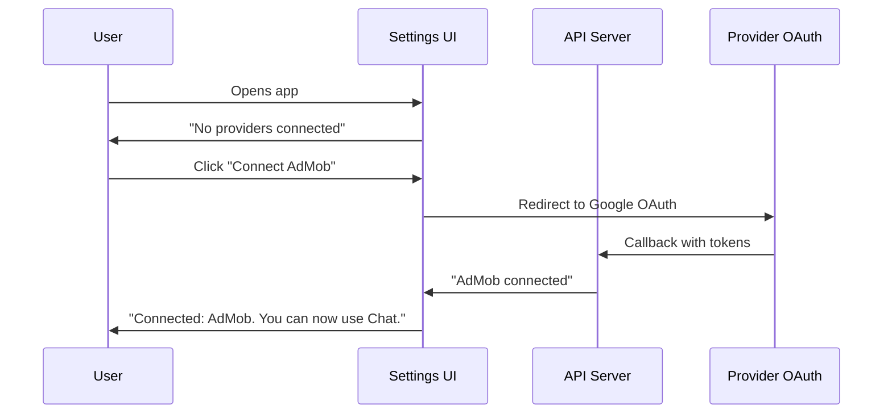

**Source:** `user_journey_2026-01-24.md` (Section 4.1)

### 4.3 Journey: Agent-Guided Network Connection (Hybrid Approach)

When the agent detects a missing or disabled network, it guides the user to Settings via deep link rather than attempting inline authentication. This applies to **all 9 networks** regardless of auth type.

**Network Auth Types:**

| Auth Type | Networks | Settings Flow |
|-----------|----------|---------------|
| **OAuth** | AdMob, Google Ad Manager | Redirect to Google OAuth |
| **API Key** | AppLovin, Unity, Mintegral, Liftoff, InMobi, Pangle, DT Exchange | Show API key form modal |

**Example Flow (OAuth Network):**

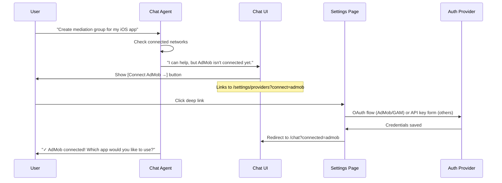

**Example Flow (API Key Network):**

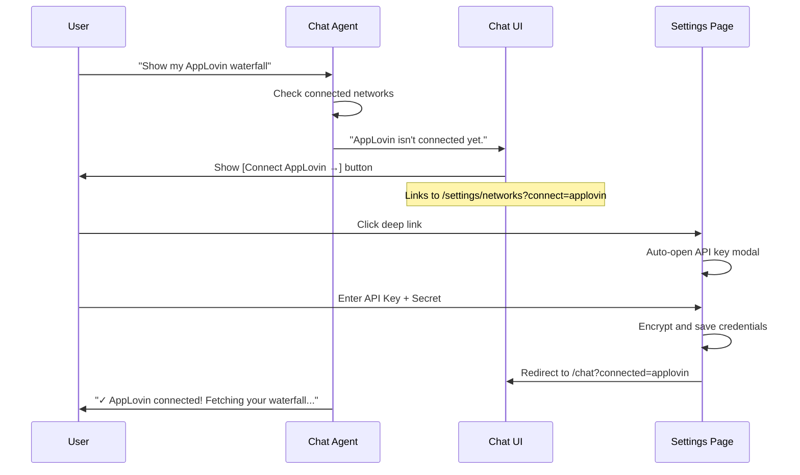

**Design Rationale:**
- **Separation of concerns**: Auth complexity stays in Settings, not Chat
- **Unified pattern**: Same UX regardless of OAuth vs API key
- **Testability**: Auth flows are isolated and easier to debug
- **Context preservation**: Return URL brings user back to conversation
- **Security**: Credentials entered in trusted Settings context, not chat

**Deep Link Parameters:**

| Parameter | Example | Description |
|-----------|---------|-------------|
| `connect` | `?connect=applovin` | Auto-opens connection modal for specified network |
| `return` | `?return=/chat/abc123` | Redirects back after successful connection |

**Return Flow Parameters:**

| Parameter | Example | Description |
|-----------|---------|-------------|
| `connected` | `?connected=applovin` | Signals successful connection, triggers agent acknowledgment |

**Supported Network Values:**

`admob`, `gam`, `applovin`, `unity`, `mintegral`, `liftoff`, `inmobi`, `pangle`, `dtexchange`

**Source:** `user_journey_2026-01-24.md` (Section 4.2), Updated to hybrid approach for all networks

### 4.4 Journey: Read-Only Request (Reactive Path)

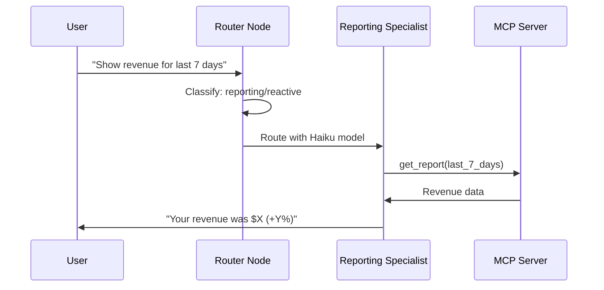

**Source:** `user_journey_2026-01-24.md` (Section 4.3), `claude_idea.md` (Reactive Path)

### 4.5 Journey: Write with Approval (Workflow Path)

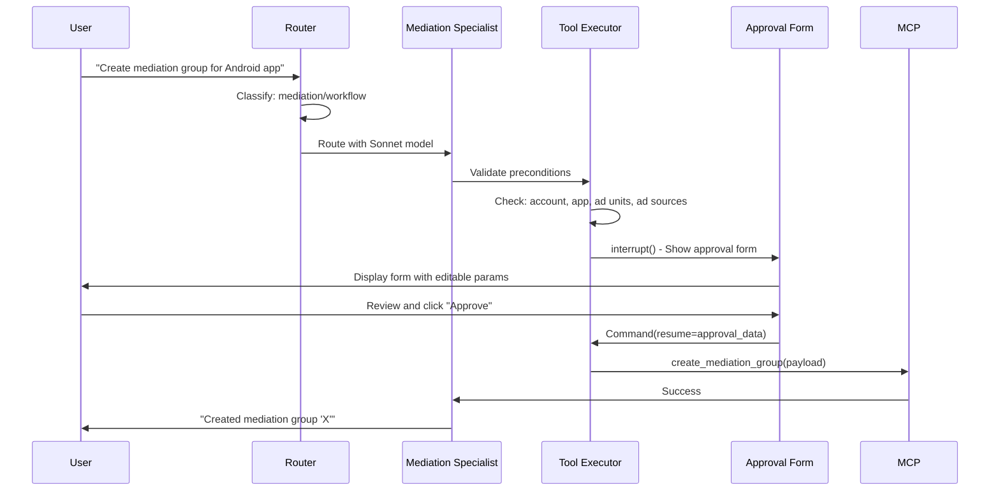

**Source:** `user_journey_2026-01-24.md` (Section 4.4), LangGraph interrupt/Command pattern

### 4.6 Journey: Failure Path

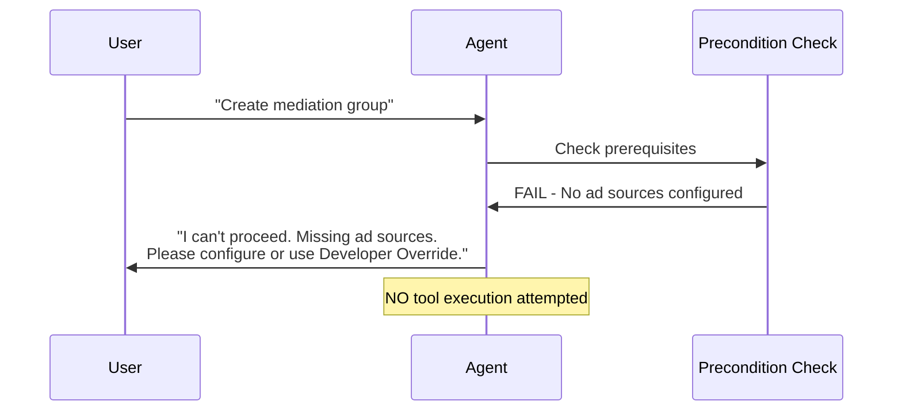

**Source:** `user_journey_2026-01-24.md` (Section 4.6)

### 4.7 Journey: Error Recovery (LLM-Driven Retry)

The agent uses **LLM-driven retry** rather than automatic retry with backoff. When a tool fails or validation errors occur, the error is returned to the LLM, which decides whether and how to retry.

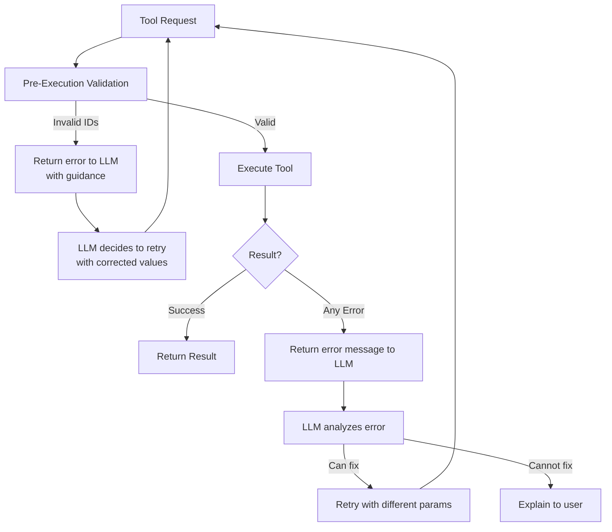

**Source:** `backend/chat/graph/nodes/tool_executor.py`

**Key Behaviors:**
1. **Pre-approval validation**: Invalid entity IDs caught before showing approval form
2. **Error returned to LLM**: Tool errors become `ToolMessage` for LLM to analyze
3. **LLM decides retry**: No automatic backoff - LLM chooses to retry or explain
4. **Guidance in errors**: Error messages include suggestions (e.g., "Use admob_list_ad_sources to get valid IDs")

**Example Error Flow:**
```
LLM: Calls create_mediation_group with invalid ad_source_id
Tool: Returns "Invalid ad source IDs: xyz123 not found. Use admob_list_ad_sources to get valid IDs."
LLM: Calls admob_list_ad_sources
LLM: Retries create_mediation_group with valid ad_source_id
Tool: Success
```

**Source:** `user_journey_2026-01-24.md` (Section 4.7)

---

## 5. LangGraph Implementation

### 5.1 Graph State

```python
from typing import TypedDict, Literal, Annotated
from langgraph.graph import add_messages

class UserContext(TypedDict):
    enabled_networks: list[str]   # Networks user has enabled in Context Settings
    enabled_accounts: list[str]   # Specific accounts selected
    safe_mode: bool               # Blocks write operations

class GraphState(TypedDict):
    # Message history
    messages: Annotated[list, add_messages]

    # Routing
    routing: dict  # {service, capability, thinking}
    execution_path: Literal["reactive", "workflow"]
    model_tier: Literal["haiku", "sonnet"]

    # Entities
    entities: dict  # {accounts, apps, ad_units, ad_sources}
    user_context: UserContext

    # Tools
    tool_calls: list[dict]
    tool_results: list[dict]

    # Verification
    verification_status: Literal["pending", "complete", "incomplete"]

    # Approval
    pending_approval: dict | None
```

**Doc Reference:** [LangGraph State Management](https://langchain-ai.github.io/langgraph/concepts/low_level/#state)

### 5.2 Human-in-the-Loop with interrupt()

```python
# Source: LangGraph interrupt documentation
# https://langchain-ai.github.io/langgraph/reference/types

from langgraph.types import interrupt, Command
from langgraph.checkpoint.postgres.aio import AsyncPostgresSaver

async def tool_executor_node(state: GraphState) -> GraphState:
    """Execute tool with approval for dangerous operations."""
    tool_call = state["tool_calls"][0]
    tool_name = tool_call["name"]
    tool_args = tool_call["args"]

    # Check if tool requires approval
    config = TOOL_REGISTRY.get(tool_name, ToolConfig())

    if config.is_dangerous:
        # Pause for human approval
        approval = interrupt({
            "type": "tool_approval_required",
            "tool": tool_name,
            "args": tool_args,
            "form_schema": get_approval_schema(tool_name),
            "question": f"Approve {tool_name}?",
        })

        if not approval.get("approved"):
            return {
                **state,
                "tool_results": [{"error": "User denied approval"}],
            }

        # User may have edited args
        tool_args = approval.get("edited_args", tool_args)

    # Execute the tool
    result = await execute_mcp_tool(tool_name, tool_args)

    return {
        **state,
        "tool_results": [result],
    }
```

**Doc Reference:** [LangGraph Interrupts](https://langchain-ai.github.io/langgraph/concepts/human_in_the_loop/)

### 5.3 Resume with Command

```python
# Source: LangGraph Command documentation

from langgraph.types import Command

# Frontend receives interrupt, shows approval UI
# User approves -> Frontend calls /approve-tool endpoint

async def approve_tool(thread_id: str, approval_data: dict):
    """Resume graph execution after user approval."""
    config = {"configurable": {"thread_id": thread_id}}

    # Resume with approval data
    async for event in graph.astream(
        Command(resume=approval_data),
        config,
        stream_mode="messages",
    ):
        yield event
```

**Doc Reference:** [LangGraph Command](https://langchain-ai.github.io/langgraph/reference/types/#langgraph.types.Command)

### 5.4 Dynamic Tool Selection with Runtime Context

```python
# Source: LangGraph Runtime documentation
# https://langchain-ai.github.io/langgraph/reference/agents

from dataclasses import dataclass
from langgraph.prebuilt import create_react_agent
from langgraph.runtime import Runtime

@dataclass
class AgentContext:
    connected_providers: list[str]
    execution_path: str
    capability: str

def configure_model_and_tools(state: GraphState, runtime: Runtime[AgentContext]):
    """Dynamically configure model and tools based on runtime context."""
    ctx = runtime.context

    # Select model based on execution path
    model_tier = MODEL_BY_PATH[ctx.execution_path]
    llm = model.with_config(configurable={"model_tier": model_tier})

    # Filter tools by connected providers and capability
    available_tools = filter_tools(
        all_tools,
        providers=ctx.connected_providers,
        capability=ctx.capability,
    )

    return llm.bind_tools(available_tools)
```

**Doc Reference:** [LangGraph Runtime Configuration](https://langchain-ai.github.io/langgraph/reference/agents/)

### 5.5 Graph Builder

```python
from langgraph.graph import StateGraph, START, END
from langgraph.checkpoint.postgres.aio import AsyncPostgresSaver

def build_graph(checkpointer: AsyncPostgresSaver):
    graph = StateGraph(GraphState)

    # Add nodes
    graph.add_node("router", router_node)
    graph.add_node("entity_loader", entity_loader_node)
    graph.add_node("tool_retriever", tool_retriever_node)
    graph.add_node("specialist", specialist_node)
    graph.add_node("tool_executor", tool_executor_node)
    graph.add_node("verifier", verifier_node)
    graph.add_node("synthesizer", synthesizer_node)

    # Add edges
    graph.add_edge(START, "router")
    graph.add_edge("router", "entity_loader")
    graph.add_edge("entity_loader", "tool_retriever")
    graph.add_edge("tool_retriever", "specialist")

    # Conditional: specialist may produce tool calls or final response
    graph.add_conditional_edges(
        "specialist",
        lambda s: "tool_executor" if s.get("tool_calls") else "synthesizer",
    )

    graph.add_edge("tool_executor", "verifier")

    # Conditional: verifier may request retry
    graph.add_conditional_edges(
        "verifier",
        lambda s: "specialist" if s.get("verification_status") == "incomplete" else "synthesizer",
    )

    graph.add_edge("synthesizer", END)

    return graph.compile(checkpointer=checkpointer)
```

**Doc Reference:** [LangGraph StateGraph](https://langchain-ai.github.io/langgraph/concepts/low_level/#stategraph)

### 5.6 Middleware & Progress Events

The system uses middleware layers and SSE events for progress tracking during tool execution.

#### SSE Event Types

| Event Type | Purpose | Payload |
|------------|---------|---------|
| `routing` | Query classification result | `{ service, capability, thinking? }` |
| `agent` | Agent transition | `{ agent, task? }` |
| `thinking` | Agent reasoning | `{ content }` |
| `tool` | Tool call initiated | `{ name, params, approved? }` |
| `tool_executing` | Progress during execution | `{ tool_name, message }` |
| `tool_result` | Tool execution result | `{ name, result }` |
| `tool_approval_required` | HITL interrupt | `{ approval_id, tool_name, tool_input, parameter_schema? }` |
| `tool_denied` | User denied tool | `{ tool_name, reason }` |
| `content` | Streaming content chunk | `{ content, is_final }` |
| `result` | Final response | `{ content }` |
| `error` | Error occurred | `{ content }` |
| `done` | Stream complete | `{}` |

**Source:** `backend/chat/streaming/events.py`

#### Tool Execution Progress

```python
# backend/chat/streaming/events.py

class ToolExecutingEvent(BaseModel):
    """Event sent when a tool starts executing (for progress UI)."""
    type: str = EventType.TOOL_EXECUTING
    tool_name: str
    message: str = "Executing..."  # Progress message to display

# Usage in tool_executor.py
async def execute_tool(tool_name: str, tool_args: dict):
    # Emit progress event before execution
    yield ToolExecutingEvent(
        tool_name=tool_name,
        message=f"Fetching data from {get_provider_name(tool_name)}..."
    )

    # Execute MCP tool
    result = await mcp_client.call_tool(tool_name, tool_args)

    # Emit result event
    yield ToolResultEvent(name=tool_name, result=result)
```

#### Semantic Tool Selector (Middleware Layer)

The middleware reduces tool search space for the LLM:

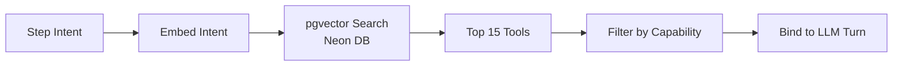

**Logic:**
1. **Capability Classification:** Router directs to capability (Mediation, Reporting, etc.)
2. **Semantic Retrieval:** pgvector retrieves top 10-15 tools matching step intent
3. **Active Binding:** Only shortlisted tools are bound to current LLM turn

**Benefits:**
- Supports 1,000+ tools with zero latency impact
- Reduces token consumption by 50-70%
- Prevents tool overload degradation

#### Verifier Node (Quality Gate)

Post-execution verification prevents hallucinations:

```python
async def verifier_node(state: GraphState) -> GraphState:
    """Verify tool results against original intent."""
    tool_result = state["tool_results"][-1]
    original_intent = state["messages"][0].content

    # Check if result is complete
    verification = await llm.ainvoke([
        SystemMessage(content=VERIFIER_PROMPT),
        HumanMessage(content=f"Intent: {original_intent}\nResult: {tool_result}"),
    ])

    if "INCOMPLETE" in verification.content:
        return {**state, "verification_status": "incomplete"}

    return {**state, "verification_status": "complete"}
```

**Verifier Responsibilities:**
- Compare tool result against original intent
- Detect missing prerequisites (e.g., `create_mediation_group` without `ad_unit_ids`)
- Force retrieval tool execution before write operations
- Route back to specialist for retry on incomplete results

### 5.7 State Persistence & Memory Tiers

The system uses PostgresSaver for checkpointing with distinct memory tiers:

| Tier | Storage | Scope | Purpose |
|------|---------|-------|---------|
| **Working Memory** | Graph State | Current turn | Entity context (`account_id`, `app_id`), tool call buffers, plan status |
| **Episodic Memory** | PostgresSaver | Session | Full conversation history, enables time-travel debugging and session resumption |
| **Long-Term Memory** | Neon Relational | User | User preferences, historical performance benchmarks, learned strategies |

```python
# backend/chat/graph/checkpointer.py

from langgraph.checkpoint.postgres.aio import AsyncPostgresSaver

async def get_checkpointer() -> AsyncPostgresSaver:
    """Get PostgresSaver connected to Neon DB."""
    return AsyncPostgresSaver.from_conn_string(
        os.environ["DATABASE_URL"],
        pipeline=True,
    )

# Time-travel debugging: replay any previous state
async def get_historical_state(thread_id: str, checkpoint_id: str):
    """Retrieve historical state for debugging."""
    config = {
        "configurable": {
            "thread_id": thread_id,
            "checkpoint_id": checkpoint_id,
        }
    }
    return await graph.aget_state(config)
```

**Benefits:**
- Session resumption across browser refreshes and multi-day workflows
- Time-travel debugging via checkpoint history
- State normalization via reducers when merging results from 9 networks

**Doc Reference:** [LangGraph Persistence](https://langchain-ai.github.io/langgraph/concepts/persistence/)

### 5.8 Loop Control & Stop Policy

Deterministic policies prevent infinite loops and ensure graceful degradation:

| Condition | Policy | Action |
|-----------|--------|--------|
| Retryable error (rate limit, timeout) | Max 3 LLM-driven retries | Error returned to LLM for correction |
| Deterministic error (PERMISSION_DENIED) | Max 2 retries then STOP | Request developer override |
| Missing prerequisites | STOP immediately | Explain what's needed, offer override |
| Max iterations reached | STOP | Synthesize partial results |

```python
# backend/chat/graph/nodes/tool_executor.py

MAX_RETRIES_RETRYABLE = 3
MAX_RETRIES_DETERMINISTIC = 2
MAX_GRAPH_ITERATIONS = 15

def classify_error(error: str) -> Literal["retryable", "deterministic"]:
    """Classify error type for retry policy."""
    DETERMINISTIC_PATTERNS = [
        "PERMISSION_DENIED",
        "NOT_FOUND",
        "INVALID_ARGUMENT",
        "ALREADY_EXISTS",
    ]
    return "deterministic" if any(p in error for p in DETERMINISTIC_PATTERNS) else "retryable"

async def handle_tool_error(state: GraphState, error: str) -> GraphState:
    """Apply stop policy based on error classification."""
    error_type = classify_error(error)
    retry_count = state.get("retry_count", 0) + 1

    max_retries = (
        MAX_RETRIES_DETERMINISTIC if error_type == "deterministic"
        else MAX_RETRIES_RETRYABLE
    )

    if retry_count >= max_retries:
        return {
            **state,
            "status": "stopped",
            "stop_reason": f"Max retries ({max_retries}) reached for {error_type} error",
            "developer_override_available": True,
        }

    return {
        **state,
        "retry_count": retry_count,
        "tool_results": [{"error": error, "retry_hint": get_retry_hint(error)}],
    }
```

**Developer Override:**
When a deterministic error causes a STOP, users can:
1. View the error context and failed tool call
2. Click "Developer Override" to bypass the stop
3. Manually provide corrected parameters via approval form

### 5.9 FastMCP Server Implementation

The unified MCP server uses FastMCP with advanced features for credential injection, tool visibility, middleware, and background tasks.

**Source:** `backend/mcp_servers/server.py`

#### 5.9.1 Network Credential Models

Each network has a specific credential structure:

| Network | Auth Type | Credential Fields | Storage Table |
|---------|-----------|-------------------|---------------|
| **AdMob** | Google OAuth | `access_token`, `refresh_token` | `connected_providers` |
| **Ad Manager** | Google OAuth | `access_token`, `refresh_token` | `connected_providers` |
| **AppLovin** | API Key | `api_key` | `network_credentials` |
| **Unity** | Service Account | `user`, `secret` | `network_credentials` |
| **Liftoff** | Secret Token | `secret_token` ⚠️ | `network_credentials` |
| **InMobi** | Multi-field | `client_id`, `client_secret`, `account_id` | `network_credentials` |
| **Pangle** | Multi-field | `user_id`, `role_id`, `security_key` | `network_credentials` |
| **Mintegral** | Multi-field | `api_key`, `secret`, `security_key` ⚠️ | `network_credentials` |
| **DT Exchange** | OAuth-style | `client_id`, `client_secret` | `network_credentials` |

⚠️ = Requires allowlist from network (contact support)

**Source:** Linear P-154

```python
# backend/mcp_servers/credentials.py

from dataclasses import dataclass

@dataclass
class OAuthCredentials:
    """For AdMob, Ad Manager (Google OAuth)"""
    access_token: str
    refresh_token: str | None = None

@dataclass
class ApiKeyCredentials:
    """For AppLovin"""
    api_key: str

@dataclass
class ServiceAccountCredentials:
    """For Unity"""
    user: str
    secret: str

@dataclass
class InMobiCredentials:
    client_id: str
    client_secret: str
    account_id: str

@dataclass
class PangleCredentials:
    user_id: str
    role_id: str
    security_key: str

@dataclass
class MintegralCredentials:
    api_key: str
    secret: str
    security_key: str

@dataclass
class DTExchangeCredentials:
    client_id: str
    client_secret: str

@dataclass
class LiftoffCredentials:
    secret_token: str
```

#### 5.9.2 JIT Credential Injection with Dependencies

FastMCP's dependency injection fetches credentials just before tool execution:

```python
# backend/mcp_servers/dependencies.py

from fastmcp import FastMCP
from fastmcp.dependencies import Depends, CurrentAccessToken
from fastmcp.server.auth import AccessToken

async def fetch_network_credentials(user_id: str, org_id: str | None, network: str):
    """
    JIT fetch credentials from Neon DB.
    - OAuth networks: from connected_providers (refresh if expired)
    - API key networks: from network_credentials (decrypt)
    """
    if network in ("admob", "admanager"):
        # OAuth - fetch and auto-refresh if expired
        row = await db.fetch_one(
            """SELECT access_token, refresh_token, token_expires_at
               FROM connected_providers
               WHERE user_id = $1 AND provider_type = $2 AND org_id = $3""",
            user_id, network, org_id
        )
        if row["token_expires_at"] < datetime.now():
            new_token = await refresh_google_oauth_token(row["refresh_token"])
            await db.execute("UPDATE connected_providers SET access_token = $1 ...", new_token)
            return OAuthCredentials(access_token=new_token, refresh_token=row["refresh_token"])
        return OAuthCredentials(access_token=row["access_token"], refresh_token=row["refresh_token"])

    else:
        # API Key networks - fetch and decrypt
        row = await db.fetch_one(
            """SELECT credentials FROM network_credentials
               WHERE user_id = $1 AND network_name = $2 AND org_id = $3""",
            user_id, network, org_id
        )
        decrypted = decrypt_aes256_gcm(row["credentials"])

        match network:
            case "applovin":
                return ApiKeyCredentials(api_key=decrypted["api_key"])
            case "unity":
                return ServiceAccountCredentials(**decrypted)
            case "inmobi":
                return InMobiCredentials(**decrypted)
            case "pangle":
                return PangleCredentials(**decrypted)
            case "mintegral":
                return MintegralCredentials(**decrypted)
            case "dtexchange":
                return DTExchangeCredentials(**decrypted)
            case "liftoff":
                return LiftoffCredentials(**decrypted)

# Network-specific dependency factories
async def get_admob_creds(token: AccessToken = CurrentAccessToken()):
    return await fetch_network_credentials(token.claims["sub"], token.claims.get("org_id"), "admob")

async def get_applovin_creds(token: AccessToken = CurrentAccessToken()):
    return await fetch_network_credentials(token.claims["sub"], token.claims.get("org_id"), "applovin")

async def get_unity_creds(token: AccessToken = CurrentAccessToken()):
    return await fetch_network_credentials(token.claims["sub"], token.claims.get("org_id"), "unity")

# ... same pattern for all 9 networks
```

**Key Benefits:**
- `Depends()` parameters are **automatically excluded from MCP schema** (LLM never sees them)
- Credentials fetched **just before execution** (JIT), never stored in agent state
- OAuth tokens **auto-refreshed** if expired
- Org-scoped for multi-tenancy

**Doc Reference:** [FastMCP Dependency Injection](https://gofastmcp.com/servers/dependency-injection)

#### 5.9.3 Tool Annotations for Approval System

FastMCP annotations signal tool behavior for the approval system:

```python
# backend/mcp_servers/server.py

mcp = FastMCP("ADAgentAI MCP")

# Read-only tool - no approval needed
@mcp.tool(
    tags={"admob", "reporting"},
    annotations={"readOnlyHint": True, "idempotentHint": True}
)
async def admob_list_apps(
    creds: OAuthCredentials = Depends(get_admob_creds)
) -> list[dict]:
    """List all AdMob apps."""
    return await admob_api.list_apps(creds.access_token)

# Dangerous tool - requires approval
@mcp.tool(
    tags={"admob", "mediation", "dangerous"},
    annotations={"destructiveHint": False, "readOnlyHint": False}
)
async def admob_create_mediation_group(
    display_name: str,
    targeting: dict,
    mediation_group_lines: list[dict],
    creds: OAuthCredentials = Depends(get_admob_creds)
) -> dict:
    """Create a new mediation group."""
    return await admob_api.create_mediation_group(
        creds.access_token, display_name, targeting, mediation_group_lines
    )

# Destructive tool - requires approval with warning
@mcp.tool(
    tags={"admob", "mediation", "dangerous"},
    annotations={"destructiveHint": True}  # Irreversible
)
async def admob_delete_mediation_group(
    mediation_group_id: str,
    creds: OAuthCredentials = Depends(get_admob_creds)
) -> dict:
    """Delete a mediation group. This action cannot be undone."""
    return await admob_api.delete_mediation_group(creds.access_token, mediation_group_id)
```

| Annotation | Value | Approval Required? |
|------------|-------|-------------------|
| `readOnlyHint: True` | Read operation | No |
| `readOnlyHint: False, destructiveHint: False` | Write operation | Yes (standard) |
| `destructiveHint: True` | Irreversible delete | Yes (with warning) |
| `idempotentHint: True` | Safe to retry | Retry allowed |

**Doc Reference:** [FastMCP Tool Annotations](https://gofastmcp.com/servers/tools#annotations)

#### 5.9.4 Dynamic Tool Visibility

FastMCP visibility controls which tools are exposed per-session:

```python
# backend/mcp_servers/server.py

from fastmcp import FastMCP

mcp = FastMCP("ADAgentAI MCP")

# Tag all tools by network
@mcp.tool(tags={"admob", "mediation"})
async def admob_create_mediation_group(...): ...

@mcp.tool(tags={"unity", "mediation"})
async def unity_create_mediation_group(...): ...

@mcp.tool(tags={"applovin", "mediation"})
async def applovin_create_placement(...): ...

# At session start: disable tools for unconnected networks
async def configure_session_visibility(ctx, connected_networks: set[str]):
    """Enable only tools for connected networks."""
    all_networks = {"admob", "admanager", "applovin", "unity", "liftoff",
                    "inmobi", "pangle", "mintegral", "dtexchange"}

    # Disable unconnected networks
    unconnected = all_networks - connected_networks
    for network in unconnected:
        await ctx.disable_components(tags={network})

    # Enable connected networks
    for network in connected_networks:
        await ctx.enable_components(tags={network})

# Per-capability filtering (for specialists)
async def configure_capability_visibility(ctx, capability: str):
    """Show only tools relevant to current specialist."""
    await ctx.disable_components(tags={"mediation", "reporting", "inventory", "orders"})
    await ctx.enable_components(tags={capability})
```

**Benefits:**
- LLM only sees tools for connected providers (no hallucinated calls)
- Specialists only see their domain tools (reduces tool overload)
- Automatic client notification when visibility changes

**Doc Reference:** [FastMCP Visibility](https://gofastmcp.com/servers/visibility)

#### 5.9.5 Background Tasks with Progress

FastMCP tasks enable long-running operations with progress reporting:

```python
# backend/mcp_servers/server.py

from fastmcp import FastMCP
from fastmcp.dependencies import Progress

mcp = FastMCP("ADAgentAI MCP")

@mcp.tool(task=True, tags={"admob", "reporting"})
async def admob_generate_network_report(
    date_range: str,
    metrics: list[str],
    dimensions: list[str],
    progress: Progress = Progress(),
    creds: OAuthCredentials = Depends(get_admob_creds)
) -> dict:
    """Generate a comprehensive AdMob network report."""

    await progress.set_message("Fetching report metadata...")
    await progress.set_total(4)

    # Step 1: Validate parameters
    await progress.set_message("Validating report parameters...")
    await progress.increment()

    # Step 2: Request report from AdMob
    await progress.set_message("Requesting report from AdMob API...")
    report_id = await admob_api.request_report(creds.access_token, date_range, metrics, dimensions)
    await progress.increment()

    # Step 3: Poll for completion
    await progress.set_message("Waiting for report generation...")
    while not await admob_api.is_report_ready(creds.access_token, report_id):
        await asyncio.sleep(2)
    await progress.increment()

    # Step 4: Fetch results
    await progress.set_message("Downloading report data...")
    result = await admob_api.download_report(creds.access_token, report_id)
    await progress.increment()

    return result
```

**Benefits:**
- Client receives task ID immediately (non-blocking)
- Progress updates stream to UI (`TOOL_EXECUTING` events)
- Works with any MCP client supporting task protocol

**Doc Reference:** [FastMCP Tasks](https://gofastmcp.com/servers/tasks)

#### 5.9.6 Built-in Middleware Stack

Production middleware for logging, rate limiting, caching, and error handling:

```python
# backend/mcp_servers/server.py

from fastmcp import FastMCP
from fastmcp.server.middleware import (
    ErrorHandlingMiddleware,
    RateLimitingMiddleware,
    SlidingWindowRateLimitingMiddleware,
    ResponseCachingMiddleware,
    LoggingMiddleware,
    TimingMiddleware,
    RetryMiddleware,
    CallToolSettings,
)

mcp = FastMCP("ADAgentAI MCP")

# Order matters: error handling first to catch all exceptions
mcp.add_middleware(ErrorHandlingMiddleware(
    include_traceback=False,  # Don't leak stack traces to client
    transform_errors=True,
))

# Retry transient errors (network timeouts, rate limits)
mcp.add_middleware(RetryMiddleware(
    max_retries=3,
    retry_exceptions=(ConnectionError, TimeoutError, RateLimitError),
))

# Rate limiting: 60 requests per minute per session
mcp.add_middleware(SlidingWindowRateLimitingMiddleware(
    max_requests=60,
    window_minutes=1,
))

# Cache read-only tool results for 30 seconds
mcp.add_middleware(ResponseCachingMiddleware(
    call_tool_settings=CallToolSettings(
        ttl=30,
        included_tools=[
            "admob_list_apps",
            "admob_list_ad_units",
            "admob_list_ad_sources",
            "admanager_list_networks",
            # ... other read-only tools
        ]
    )
))

# Performance timing
mcp.add_middleware(TimingMiddleware())

# Structured logging for observability
mcp.add_middleware(LoggingMiddleware(
    include_payloads=True,
    max_payload_length=1000,
))
```

| Middleware | Purpose | Configuration |
|------------|---------|---------------|
| `ErrorHandlingMiddleware` | Centralized error handling | `include_traceback=False` |
| `RetryMiddleware` | Auto-retry transient errors | `max_retries=3` |
| `SlidingWindowRateLimitingMiddleware` | Per-session rate limits | `60 req/min` |
| `ResponseCachingMiddleware` | Cache read-only results | `ttl=30s` |
| `TimingMiddleware` | Performance metrics | Default |
| `LoggingMiddleware` | Request/response logging | `include_payloads=True` |

**Doc Reference:** [FastMCP Middleware](https://gofastmcp.com/servers/middleware)

#### 5.9.7 Complete Server Setup

```python
# backend/mcp_servers/server.py

from fastmcp import FastMCP
from fastmcp.server.auth import require_auth

mcp = FastMCP(
    "ADAgentAI MCP",
    version="1.0.0",
    list_page_size=50,  # Pagination for 252+ tools
)

# Add middleware stack (order matters)
mcp.add_middleware(ErrorHandlingMiddleware())
mcp.add_middleware(RetryMiddleware(max_retries=3))
mcp.add_middleware(SlidingWindowRateLimitingMiddleware(max_requests=60, window_minutes=1))
mcp.add_middleware(ResponseCachingMiddleware(...))
mcp.add_middleware(TimingMiddleware())
mcp.add_middleware(LoggingMiddleware())

# Register all tools with tags and annotations
# AdMob (19 tools)
from .providers.admob import register_admob_tools
register_admob_tools(mcp)

# Ad Manager (154 tools)
from .providers.admanager import register_admanager_tools
register_admanager_tools(mcp)

# AppLovin (20 tools)
from .providers.applovin import register_applovin_tools
register_applovin_tools(mcp)

# ... register all 9 networks

if __name__ == "__main__":
    mcp.run()
```

**FastMCP Features Summary:**

| Feature | Purpose | Spec Section |
|---------|---------|--------------|
| **Dependency Injection** | JIT credential injection | 5.9.2 |
| **Tool Annotations** | Approval system hints | 5.9.3 |
| **Visibility** | Per-session tool filtering | 5.9.4 |
| **Tasks** | Background operations with progress | 5.9.5 |
| **Middleware** | Logging, rate limiting, caching, errors | 5.9.6 |
| **Pagination** | Handle 252+ tools | 5.9.7 |

---

## 6. LangSmith Testing & Evaluation

### 6.1 Testing Strategy

| Test Type | Purpose | Tool |
|-----------|---------|------|
| **Manual Verification** | Interactive debugging after each iteration | agent-browser + Chrome DevTools MCP + LangSmith MCP |
| Integration Tests | End-to-end flows | LangSmith datasets + evaluate() |
| Online Evaluation | Production monitoring | LangSmith traces + feedback |

**Note:** No automated unit tests (pytest) in this spec. All verification is done via manual debugging with development tools and LangSmith datasets.

**Development Tools:**

| Tool | Type | Commands | Best For |
|------|------|----------|----------|
| [agent-browser](https://agent-browser.dev/) | CLI | 50+ | Headless browser automation, form filling, session isolation, AI-optimized snapshots |
| [Chrome DevTools MCP](https://github.com/AjayNandoriya/chrome-devtools-mcp) | MCP Server | 26 | Live browser debugging, network inspection, console logs, DOM inspection |
| [LangSmith MCP](https://github.com/langchain-ai/langsmith-mcp-server) | MCP Server | 12 | Agent traces, prompts, datasets, experiments |

**When to Use Each:**
- **agent-browser**: Automated UI flows, multi-session testing, accessibility tree snapshots with ref IDs for deterministic element selection
- **Chrome DevTools MCP**: Live debugging in existing browser, inspecting network requests, viewing console errors, real-time DOM changes
- **LangSmith MCP**: Tracing agent execution, viewing prompts/tool calls, debugging graph node transitions

**Primary Development Flow:**
```
Code change → Run agent → agent-browser / Chrome DevTools MCP + LangSmith MCP → Verify behavior
```

**Debugging Flow (when issues arise):**
```
1. Add temporary debug logs (console.log / logger.debug)
2. Reproduce issue
3. Browser debugging (choose based on need):
   agent-browser:
   - snapshot → Get accessibility tree with ref IDs
   - click @ref → Interact with elements deterministically
   - screenshot → Capture UI state
   Chrome DevTools MCP:
   - list_network_requests → Check API calls
   - list_console_messages → View errors
   - take_screenshot → Capture UI state
4. LangSmith MCP:
   - fetch_runs → View agent traces
   - Analyze node execution, prompts, tool calls
5. Fix issue → Remove debug logs → Verify fix
```

See Section 8.5 for detailed debugging guide.

**Doc Reference:** [LangSmith Evaluation](https://docs.langchain.com/langsmith/evaluation)

### 6.2 Evaluation Datasets

```python
# Source: LangSmith dataset documentation
# https://docs.langchain.com/langsmith/manage-datasets-programmatically

from langsmith import Client

client = Client()

# Dataset: Router Classification
router_examples = [
    {
        "inputs": {"query": "What was my revenue yesterday?"},
        "outputs": {"service": "admob", "capability": "reporting", "path": "reactive"},
    },
    {
        "inputs": {"query": "Create a mediation group for my Android app"},
        "outputs": {"service": "admob", "capability": "mediation", "path": "workflow"},
    },
    {
        "inputs": {"query": "List all line items in order 12345"},
        "outputs": {"service": "admanager", "capability": "orders", "path": "reactive"},
    },
    {
        "inputs": {"query": "Hello, how are you?"},
        "outputs": {"service": "general", "capability": "assistant", "path": "reactive"},
    },
]

dataset = client.create_dataset("ADAgentAI: Router Classification")
client.create_examples(dataset_id=dataset.id, examples=router_examples)


# Dataset: Tool Selection
tool_selection_examples = [
    {
        "inputs": {
            "query": "Show my AdMob apps",
            "routing": {"service": "admob", "capability": "inventory"},
        },
        "outputs": {"tool": "admob_list_apps"},
    },
    {
        "inputs": {
            "query": "Get revenue for last 7 days",
            "routing": {"service": "admob", "capability": "reporting"},
        },
        "outputs": {"tool": "admob_generate_mediation_report"},
    },
]

dataset = client.create_dataset("ADAgentAI: Tool Selection")
client.create_examples(dataset_id=dataset.id, examples=tool_selection_examples)


# Dataset: End-to-End Journeys
e2e_examples = [
    {
        "inputs": {"messages": [{"role": "user", "content": "What was my revenue yesterday?"}]},
        "outputs": {
            "trajectory": ["router", "entity_loader", "tool_retriever", "specialist", "tool_executor", "verifier", "synthesizer"],
            "tools_called": ["admob_generate_mediation_report"],
            "final_response_contains": ["revenue", "$"],
        },
    },
]

dataset = client.create_dataset("ADAgentAI: E2E Journeys")
client.create_examples(dataset_id=dataset.id, examples=e2e_examples)
```

**Doc Reference:** [LangSmith Create Dataset](https://docs.langchain.com/langsmith/manage-datasets-programmatically)

### 6.3 Custom Evaluators

```python
from langsmith import Client

def correct_route(inputs: dict, outputs: dict, reference_outputs: dict) -> bool:
    """Check if router selected correct service and capability."""
    return (
        outputs.get("service") == reference_outputs.get("service") and
        outputs.get("capability") == reference_outputs.get("capability")
    )

def correct_tool(inputs: dict, outputs: dict, reference_outputs: dict) -> bool:
    """Check if specialist selected correct tool."""
    return outputs.get("tool") == reference_outputs.get("tool")

def trajectory_match(inputs: dict, outputs: dict, reference_outputs: dict) -> float:
    """Score trajectory similarity (0-1)."""
    expected = reference_outputs.get("trajectory", [])
    actual = outputs.get("trajectory", [])

    if not expected:
        return 1.0

    matches = sum(1 for e, a in zip(expected, actual) if e == a)
    return matches / len(expected)

# Run evaluation
client = Client()
results = client.evaluate(
    agent.invoke,
    data="ADAgentAI: E2E Journeys",
    evaluators=[correct_route, correct_tool, trajectory_match],
    experiment_prefix="v1.0-baseline",
)
```

**Doc Reference:** [LangSmith Evaluate](https://docs.langchain.com/langsmith/evaluation)

### 6.4 Online Evaluation (Production)

```python
from langsmith import traceable
from langsmith.wrappers import wrap_openai

@traceable(name="chat_stream", run_type="chain")
async def chat_stream(query: str, thread_id: str, user_id: str):
    """Traced chat endpoint for production monitoring."""
    config = {"configurable": {"thread_id": thread_id}}

    async for event in graph.astream(
        {"messages": [{"role": "user", "content": query}]},
        config,
        stream_mode="messages",
    ):
        yield event
```

Enable feedback collection in production:
- Log user reactions (thumbs up/down)
- Track tool success rates

**Doc Reference:** [LangSmith Tracing](https://docs.langchain.com/langsmith/tracing)

---

## 7. Multi-Tenancy & Organization Support

Organizations are managed via **Neon Auth** (organization plugin). Users can operate in Personal mode or switch to an Organization context.

**Source Files:**
- `frontend/src/contexts/user-context.tsx` - Organization state management
- `frontend/src/components/layout/OrganizationSwitcher.tsx` - Workspace dropdown
- `frontend/src/components/chat/chat-container.tsx` - Chat streaming (⚠️ has bug)
- `backend/api/src/routes/providers.ts` - Provider CRUD with org scoping
- `backend/api/src/routes/chat.ts` - Session CRUD with org scoping
- `backend/chat_server.py` - Agent entry point

### 7.1 Implementation Status (Detailed)

#### 7.1.1 Database Layer (✅ Fully Implemented)

| Table | `organization_id` Column | Scoping Logic |
|-------|-------------------------|---------------|
| `connected_providers` | ✅ `organization_id TEXT` | `NULL` = personal, otherwise org-scoped |
| `chat_sessions` | ✅ `organization_id TEXT` | `NULL` = personal, otherwise org-scoped |
| `run_summaries` | ✅ `organization_id TEXT` | For billing aggregation by org |
| `members` | ✅ `organization_id TEXT` | Neon Auth membership |
| `invitations` | ✅ `organization_id TEXT` | Neon Auth invitations |
| `organization_invite_links` | ✅ `organization_id TEXT` | Shareable links |

#### 7.1.2 Backend API Layer (✅ Fully Implemented)

| Route | Org Scoping | Admin Check |
|-------|-------------|-------------|
| `GET /api/providers` | ✅ Filters by `user.organizationId` | N/A (read) |
| `POST /api/providers/connect` | ✅ Stores with org context | ✅ Only admins/owners |
| `DELETE /api/providers/:id` | ✅ Validates org match | ✅ Only admins/owners |
| `GET /api/chat/sessions` | ✅ Filters by org context | N/A (read) |
| `POST /api/chat/sessions` | ✅ Creates with org context | N/A (create) |
| `POST /api/internal/token` | ✅ Accepts `organizationId` param | Internal only |

#### 7.1.3 Chat Agent Layer (✅ Fully Implemented)

| Component | Org Support | Source |
|-----------|-------------|--------|
| `chat_server.py` | ✅ Reads `organization_id` from request body/header | Line 125-130 |
| `GraphState` | ✅ Carries `organization_id` | `chat/graph/state.py:45` |
| `entity_loader` node | ✅ Passes org to provider lookup | `chat/graph/nodes/entity_loader.py:24` |
| `tool_executor` node | ✅ Uses org for entity resolution | `chat/graph/nodes/tool_executor.py:113` |
| `entity_resolver` | ✅ Filters providers by org | `chat/utils/entity_resolver.py:268` |

#### 7.1.4 Frontend Layer (⚠️ Partially Implemented)

| Component | Status | Issue |
|-----------|--------|-------|
| `UserContext` | ✅ Exposes `selectedOrganizationId` | Works correctly |
| `OrganizationSwitcher` | ✅ Allows workspace switching | Works correctly |
| `EntityDataProvider` | ✅ Passes org to field options API | Works correctly |
| **`ChatContainer`** | ❌ **BROKEN** | Does NOT pass `selectedOrganizationId` to `streamChat` |
| `ContextSettings` | ⚠️ User-global | Not org-scoped (by design?) |
| Provider Settings | ⚠️ Implicit | Works via API header, not explicit in UI |

### 7.2 The Critical Bug: Chat Container

**Location:** `frontend/src/components/chat/chat-container.tsx`

**Problem:** The chat container uses `useUser()` but does NOT destructure or pass `selectedOrganizationId`:

```typescript
// Line 37 - CURRENT (broken)
const { user, getAccessToken } = useUser()
//      ^^^^^^^^^^^^^^^^^^^^^ Missing: selectedOrganizationId

// Lines 392-397 - streamChat call without org context
await streamChat(
  content,
  callbacks,
  abortControllerRef.current.signal,
  userId,
  history,
  chatContext,
  accessToken
  // ❌ MISSING: selectedOrganizationId (8th parameter)
)
```

**Impact:**
1. Chat agent receives `organization_id: undefined`
2. Agent falls back to personal providers (or fails)
3. Chat sessions created without org scope
4. User in org context sees wrong data

**Fix Required:**
```typescript
// Line 37 - Add selectedOrganizationId
const { user, getAccessToken, selectedOrganizationId } = useUser()

// Line 397 - Pass to streamChat
await streamChat(
  content,
  callbacks,
  abortControllerRef.current.signal,
  userId,
  history,
  chatContext,
  accessToken,
  selectedOrganizationId  // ← ADD THIS
)
```

### 7.3 User Context API

```typescript
// Source: frontend/src/contexts/user-context.tsx

interface UserContextValue {
  // User
  user: User | null
  getAccessToken: () => Promise<string | null>

  // Organization state
  selectedOrganization: Organization | null
  selectedOrganizationId: string | null      // ← KEY: Pass this to chat!
  selectedOrgRole: string | null             // "owner" | "admin" | "member"
  organizations: Organization[]

  // Organization actions
  selectOrganization: (orgId: string | null) => void
  createOrganization: (name: string) => Promise<Organization | null>

  // Invitations
  receivedInvitations: ReceivedInvitation[]
  acceptInvitation: (invitationId: string) => Promise<boolean>
  rejectInvitation: (invitationId: string) => Promise<boolean>
}
```

### 7.4 User Journeys by Workspace Type

Each journey includes:
- **UI State**: What the user sees at each step
- **Data Flow**: What happens behind the scenes
- **Current Status**: ✅ Working, ❌ Broken, ⚠️ Partial

---

#### Journey A: Personal User (Solo Publisher)

**Persona**: Independent app developer managing their own AdMob account.

**UI Flow:**

```
┌─────────────────────────────────────────────────────────────────────┐
│  STEP 1: Sign In                                                    │
├─────────────────────────────────────────────────────────────────────┤
│                                                                     │
│   ┌─────────────────────────┐                                       │
│   │  Sign in with Google    │  ← User clicks                        │
│   └─────────────────────────┘                                       │
│                                                                     │
│   → Redirects to Google OAuth                                       │
│   → Returns to /chat                                                │
│   → UserContext initializes: selectedOrganizationId = null          │
│                                                                     │
│   Status: ✅ Working                                                 │
└─────────────────────────────────────────────────────────────────────┘

┌─────────────────────────────────────────────────────────────────────┐
│  STEP 2: Connect Provider (First Time)                              │
├─────────────────────────────────────────────────────────────────────┤
│                                                                     │
│  ┌──────────────────┬────────────────────────────────────────────┐  │
│  │  SIDEBAR         │  CHAT AREA                                 │  │
│  │                  │                                            │  │
│  │  [👤] Personal ▼ │  "How can I help you today?"               │  │
│  │  ─────────────── │                                            │  │
│  │  ⚙️ Settings     │  ┌────────────────────────────────────┐    │  │
│  │                  │  │ Ask anything about your ads...     │    │  │
│  │  NETWORKS        │  └────────────────────────────────────┘    │  │
│  │  ─────────────── │                                            │  │
│  │  AdMob      [🔗] │  ← "Connect" badge (no provider yet)       │  │
│  │  GAM        [🔗] │                                            │  │
│  │  AppLovin   [🔗] │                                            │  │
│  └──────────────────┴────────────────────────────────────────────┘  │
│                                                                     │
│  User clicks [🔗] Connect on AdMob:                                 │
│  → Opens Settings → Networks tab                                    │
│  → Initiates Google OAuth for AdMob                                 │
│  → POST /api/providers/connect { organizationId: null }             │
│  → Provider stored with org_id = NULL (personal scope)              │
│                                                                     │
│  Status: ✅ Working                                                  │
└─────────────────────────────────────────────────────────────────────┘

┌─────────────────────────────────────────────────────────────────────┐
│  STEP 3: Chat with Personal Providers                               │
├─────────────────────────────────────────────────────────────────────┤
│                                                                     │
│  ┌──────────────────┬────────────────────────────────────────────┐  │
│  │  SIDEBAR         │  CHAT AREA                                 │  │
│  │                  │                                            │  │
│  │  [👤] Personal ▼ │  USER: "What was my revenue yesterday?"    │  │
│  │  ─────────────── │                                            │  │
│  │  ⚙️ Settings     │  ┌─────────────────────────────────────┐   │  │
│  │                  │  │ 🤔 Routing: admob / reporting       │   │  │
│  │  NETWORKS        │  │ 🔧 Tool: admob_generate_report      │   │  │
│  │  ─────────────── │  │ ✅ Result: Revenue data retrieved   │   │  │
│  │  AdMob      [✓]  │  └─────────────────────────────────────┘   │  │
│  │  GAM        [🔗] │                                            │  │
│  │  AppLovin   [🔗] │  ASSISTANT: "Your revenue yesterday was    │  │
│  └──────────────────┴  $1,234.56 across 3 apps..."               │  │
│                                                                     │
│  Data Flow:                                                         │
│  1. ChatContainer calls streamChat(message, ..., accessToken)       │
│     ❌ BUG: Does NOT pass selectedOrganizationId!                   │
│  2. Agent receives organization_id: undefined                       │
│  3. Agent calls GET /api/internal/providers?orgId=                  │
│  4. API falls back to personal providers (org_id IS NULL)           │
│  5. ⚠️ WORKS BY ACCIDENT for personal users (null = null match)    │
│                                                                     │
│  Status: ⚠️ Works but fragile (relies on null fallback)            │
└─────────────────────────────────────────────────────────────────────┘
```

---

#### Journey B: Organization Admin Setup

**Persona**: Agency owner setting up shared workspace for team.

**UI Flow:**

```
┌─────────────────────────────────────────────────────────────────────┐
│  STEP 1: Create Organization                                        │
├─────────────────────────────────────────────────────────────────────┤
│                                                                     │
│  ┌──────────────────┬────────────────────────────────────────────┐  │
│  │  SIDEBAR         │                                            │  │
│  │                  │  User clicks dropdown, then "+ Create"     │  │
│  │  [👤] Personal ▼ │                                            │  │
│  │  ┌─────────────────────────┐                                  │  │
│  │  │ [👤] Personal       ✓  │  ← Current                        │  │
│  │  ├─────────────────────────┤                                  │  │
│  │  │ Organizations           │                                  │  │
│  │  │ (none yet)              │                                  │  │
│  │  ├─────────────────────────┤                                  │  │
│  │  │ [+] Create organization │  ← Click here                    │  │
│  │  └─────────────────────────┘                                  │  │
│  └──────────────────┴────────────────────────────────────────────┘  │
│                                                                     │
│  Dialog appears:                                                    │
│  ┌───────────────────────────────────────┐                          │
│  │  Create Organization                  │                          │
│  │  ─────────────────────────────────── │                          │
│  │  Name: [Acme Agency____________]     │                          │
│  │                                       │                          │
│  │         [Cancel]  [Create]            │                          │
│  └───────────────────────────────────────┘                          │
│                                                                     │
│  → Calls authClient.organization.create({ name: "Acme Agency" })    │
│  → Organization created in Neon Auth                                │
│  → UI auto-switches: selectedOrganizationId = "acme-uuid"           │
│  → User becomes "owner" role                                        │
│                                                                     │
│  Status: ✅ Working                                                  │
└─────────────────────────────────────────────────────────────────────┘

┌─────────────────────────────────────────────────────────────────────┐
│  STEP 2: Connect Providers for Organization                         │
├─────────────────────────────────────────────────────────────────────┤
│                                                                     │
│  ┌──────────────────┬────────────────────────────────────────────┐  │
│  │  SIDEBAR         │  SETTINGS PAGE                             │  │
│  │                  │                                            │  │
│  │  [👥] Acme Ag.. ▼│  Networks                                  │  │
│  │  ─────────────── │  ──────────────────────────────────────── │  │
│  │  ⚙️ Settings     │                                            │  │
│  │  👥 Team         │  PRIMARY NETWORKS                          │  │
│  │                  │  ┌─────────────────────────────────────┐   │  │
│  │  NETWORKS        │  │ AdMob                    [Connect]  │   │  │
│  │  ─────────────── │  │ Google OAuth required               │   │  │
│  │  AdMob      [🔗] │  └─────────────────────────────────────┘   │  │
│  │  GAM        [🔗] │  ┌─────────────────────────────────────┐   │  │
│  │                  │  │ Ad Manager (GAM)        [Connect]  │   │  │
│  └──────────────────┴──└─────────────────────────────────────┘   │  │
│                                                                     │
│  Admin clicks [Connect] on AdMob:                                   │
│  → Google OAuth popup                                               │
│  → POST /api/providers/connect                                      │
│    Headers: { "x-organization-id": "acme-uuid" }                    │
│  → API checks: isOrgAdmin(userId, "acme-uuid") → true (owner)       │
│  → Provider stored: { organization_id: "acme-uuid", ... }           │
│                                                                     │
│  Status: ✅ Working                                                  │
└─────────────────────────────────────────────────────────────────────┘

┌─────────────────────────────────────────────────────────────────────┐
│  STEP 3: Invite Team Members                                        │
├─────────────────────────────────────────────────────────────────────┤
│                                                                     │
│  ┌──────────────────┬────────────────────────────────────────────┐  │
│  │  SIDEBAR         │  TEAM PAGE (/settings/team)                │  │
│  │                  │                                            │  │
│  │  [👥] Acme Ag.. ▼│  Team Members                              │  │
│  │  ─────────────── │  ──────────────────────────────────────── │  │
│  │  ⚙️ Settings     │                                            │  │
│  │  👥 Team     ←   │  ┌─────────────────────────────────────┐   │  │
│  │                  │  │ 👤 admin@acme.com        Owner      │   │  │
│  │                  │  └─────────────────────────────────────┘   │  │
│  │                  │                                            │  │
│  │                  │  [+ Invite Member]                         │  │
│  │                  │                                            │  │
│  │                  │  Or share invite link:                     │  │
│  │                  │  ┌─────────────────────────────────────┐   │  │
│  │                  │  │ https://app.../invite/abc123       │   │  │
│  │                  │  │                           [Copy]    │   │  │
│  └──────────────────┴──└─────────────────────────────────────┘   │  │
│                                                                     │
│  Invite by email:                                                   │
│  → authClient.organization.inviteMembers([{email, role}])           │
│  → Neon Auth sends invitation email                                 │
│                                                                     │
│  Invite link:                                                       │
│  → POST /api/organizations/:id/invite-links                         │
│  → Creates reusable link in organization_invite_links table         │
│                                                                     │
│  Status: ✅ Working                                                  │
└─────────────────────────────────────────────────────────────────────┘
```

---

#### Journey C: Organization Member Access

**Persona**: Team member joining existing organization.

**UI Flow:**

```
┌─────────────────────────────────────────────────────────────────────┐
│  STEP 1: Receive & Accept Invitation                                │
├─────────────────────────────────────────────────────────────────────┤
│                                                                     │
│  ┌───────────────────────────────────────────────────────────────┐  │
│  │  HEADER BAR (after sign in)                                   │  │
│  │  ┌─────────────────────────────────────────────────────────┐  │  │
│  │  │ 📩 You have 1 pending invitation                        │  │  │
│  │  │    "Acme Agency" invited you as Member                  │  │  │
│  │  │                        [Reject]  [Accept]               │  │  │
│  │  └─────────────────────────────────────────────────────────┘  │  │
│  └───────────────────────────────────────────────────────────────┘  │
│                                                                     │
│  User clicks [Accept]:                                              │
│  → authClient.organization.acceptInvitation(invitationId)           │
│  → User added to organization as "member"                           │
│  → receivedInvitations list updates (invitation removed)            │
│  → organizations list updates (Acme Agency added)                   │
│                                                                     │
│  Status: ✅ Working                                                  │
└─────────────────────────────────────────────────────────────────────┘

┌─────────────────────────────────────────────────────────────────────┐
│  STEP 2: Switch to Organization Context                             │
├─────────────────────────────────────────────────────────────────────┤
│                                                                     │
│  ┌──────────────────┐                                               │
│  │  [👤] Personal ▼ │  ← Click dropdown                             │
│  │  ┌─────────────────────────┐                                     │
│  │  │ [👤] Personal       ✓  │                                     │
│  │  ├─────────────────────────┤                                     │
│  │  │ Organizations           │                                     │
│  │  │ [👥] Acme Agency        │  ← Click to switch                  │
│  │  └─────────────────────────┘                                     │
│  └──────────────────┘                                               │
│                                                                     │
│  User clicks "Acme Agency":                                         │
│  → selectOrganization("acme-uuid")                                  │
│  → selectedOrganizationId = "acme-uuid"                             │
│  → selectedOrgRole = "member"                                       │
│  → EntityDataProvider clears cache (org context changed)            │
│  → Sidebar networks list reloads with org's providers               │
│                                                                     │
│  Status: ✅ Working                                                  │
└─────────────────────────────────────────────────────────────────────┘

┌─────────────────────────────────────────────────────────────────────┐
│  STEP 3: Chat in Organization Context                               │
├─────────────────────────────────────────────────────────────────────┤
│                                                                     │
│  ┌──────────────────┬────────────────────────────────────────────┐  │
│  │  SIDEBAR         │  CHAT AREA                                 │  │
│  │                  │                                            │  │
│  │  [👥] Acme Ag.. ▼│  USER: "Show me yesterday's revenue"       │  │
│  │  ─────────────── │                                            │  │
│  │  ⚙️ Settings     │  ┌─────────────────────────────────────┐   │  │
│  │  👥 Team         │  │ 🤔 Routing: admob / reporting       │   │  │
│  │                  │  │ 🔧 Tool: admob_generate_report      │   │  │
│  │  NETWORKS        │  │ ❌ ERROR: No providers found        │   │  │
│  │  ─────────────── │  └─────────────────────────────────────┘   │  │
│  │  AdMob      [✓]  │                                            │  │
│  │  GAM        [✓]  │  ASSISTANT: "I couldn't find any          │  │
│  └──────────────────┴  connected providers..."                   │  │
│                                                                     │
│  ❌ BUG DATA FLOW:                                                  │
│  1. ChatContainer calls streamChat(message, ..., accessToken)       │
│     → Does NOT pass selectedOrganizationId!                         │
│  2. Agent receives: { organization_id: undefined }                  │
│  3. Agent calls GET /api/internal/providers?orgId=                  │
│  4. API query: WHERE organization_id IS NULL (personal!)            │
│  5. Returns: [] (member has no personal providers)                  │
│  6. Agent fails: "No providers found"                               │
│                                                                     │
│  Expected Flow (after fix):                                         │
│  1. ChatContainer calls streamChat(..., selectedOrganizationId)     │
│  2. Agent receives: { organization_id: "acme-uuid" }                │
│  3. API query: WHERE organization_id = "acme-uuid"                  │
│  4. Returns: [AdMob, GAM] (org providers)                           │
│  5. Agent succeeds with org data                                    │
│                                                                     │
│  Status: ❌ BROKEN - Chat ignores organization context              │
└─────────────────────────────────────────────────────────────────────┘
```

---

#### Journey D: Switching Between Workspaces

**Persona**: User who has both personal apps and belongs to an agency.

**UI Flow:**

```
┌─────────────────────────────────────────────────────────────────────┐
│  SCENARIO: User has personal AdMob + member of Acme (org AdMob)     │
├─────────────────────────────────────────────────────────────────────┤
│                                                                     │
│  STATE 1: Personal Mode                                             │
│  ──────────────────────                                             │
│  ┌──────────────────┬────────────────────────────────────────────┐  │
│  │  [👤] Personal ▼ │  CHAT                                      │  │
│  │  ─────────────── │                                            │  │
│  │  NETWORKS        │  USER: "List my apps"                      │  │
│  │  AdMob      [✓]  │                                            │  │
│  │  (1 account)     │  ASSISTANT: "You have 2 apps:              │  │
│  └──────────────────┴  - My Game (Android)                       │  │
│                        - My Puzzle (iOS)"                           │
│                                                                     │
│  Context: selectedOrganizationId = null                             │
│  Providers: Personal AdMob only                                     │
│                                                                     │
└─────────────────────────────────────────────────────────────────────┘

                              ↓ User switches workspace ↓

┌─────────────────────────────────────────────────────────────────────┐
│  STATE 2: Organization Mode (After Switch)                          │
│  ─────────────────────────────────────────                          │
│  ┌──────────────────┬────────────────────────────────────────────┐  │
│  │  [👥] Acme Ag.. ▼│  CHAT                                      │  │
│  │  ─────────────── │                                            │  │
│  │  NETWORKS        │  USER: "List my apps"                      │  │
│  │  AdMob      [✓]  │                                            │  │
│  │  (3 accounts)    │  EXPECTED: "Acme Agency has 15 apps:       │  │
│  │  GAM        [✓]  │  - Client App 1, Client App 2, ..."        │  │
│  │  (1 network)     │                                            │  │
│  └──────────────────┴  ACTUAL (BUG): "You have 2 apps:           │  │
│                        - My Game, My Puzzle" (wrong - personal!)    │
│                                                                     │
│  Context: selectedOrganizationId = "acme-uuid"                      │
│                                                                     │
│  What happens:                                                      │
│  1. ✅ Sidebar updates: Shows org's providers (3 AdMob accounts)   │
│  2. ✅ Entity dropdowns: Would show org's apps (EntityDataProvider) │
│  3. ❌ Chat: Uses personal providers (bug in ChatContainer)        │
│                                                                     │
│  Status: ❌ BROKEN - Chat doesn't respect workspace switch          │
└─────────────────────────────────────────────────────────────────────┘
```

---

#### Journey E: Role-Based Permissions

**Persona**: Understanding what different roles can do.

```
┌─────────────────────────────────────────────────────────────────────┐
│  PERMISSION MATRIX                                                  │
├───────────────────────┬─────────┬─────────┬─────────────────────────┤
│  Action               │ Owner   │ Admin   │ Member                  │
├───────────────────────┼─────────┼─────────┼─────────────────────────┤
│  View org providers   │ ✅      │ ✅      │ ✅                      │
│  Chat with org data   │ ✅*     │ ✅*     │ ✅* (*bug: broken)      │
│  Connect providers    │ ✅      │ ✅      │ ❌ "Only admins can..." │
│  Disconnect providers │ ✅      │ ✅      │ ❌ "Only admins can..." │
│  Invite members       │ ✅      │ ✅      │ ❌                      │
│  Remove members       │ ✅      │ ✅      │ ❌                      │
│  Delete organization  │ ✅      │ ❌      │ ❌                      │
│  View team settings   │ ✅      │ ✅      │ ✅ (read-only)          │
│  Leave organization   │ ❌†     │ ✅      │ ✅                      │
└───────────────────────┴─────────┴─────────┴─────────────────────────┘

†Owner must transfer ownership or delete org first

UI Enforcement:
- Connect/Disconnect buttons hidden for members
- Team management options hidden for members
- Error toasts shown if API returns 403
```

**Source:** `backend/api/src/routes/providers.ts:isOrgAdmin()`

---

### 7.5 Complete Data Flow: Organization Context

This diagram shows how `organization_id` should flow from UI to agent (after fix is applied):

```
┌─────────────────────────────────────────────────────────────────────────────┐
│                        FRONTEND (Next.js)                                   │
├─────────────────────────────────────────────────────────────────────────────┤
│                                                                             │
│  ┌─────────────────────┐                                                    │
│  │  UserContext        │  selectedOrganizationId: "acme-uuid" | null        │
│  │  (user-context.tsx) │  ─────────────────────────────────────────────    │
│  └──────────┬──────────┘  Persisted to localStorage: selectedOrganizationId │
│             │                                                               │
│             │ useUser() hook                                                │
│             ▼                                                               │
│  ┌─────────────────────┐                                                    │
│  │  ChatContainer      │  ❌ CURRENT: Ignores selectedOrganizationId        │
│  │  (chat-container)   │  ✅ FIXED: Passes to streamChat()                  │
│  └──────────┬──────────┘                                                    │
│             │                                                               │
│             │ streamChat(message, callbacks, ..., organizationId)           │
│             ▼                                                               │
│  ┌─────────────────────┐                                                    │
│  │  API Client         │  Headers: { "x-organization-id": "acme-uuid" }     │
│  │  (lib/api.ts)       │  Body: { organization_id: "acme-uuid" }            │
│  └──────────┬──────────┘                                                    │
│             │                                                               │
└─────────────┼───────────────────────────────────────────────────────────────┘
              │ HTTP POST /chat/stream
              ▼
┌─────────────────────────────────────────────────────────────────────────────┐
│                        CHAT AGENT (FastAPI)                                 │
├─────────────────────────────────────────────────────────────────────────────┤
│                                                                             │
│  ┌─────────────────────┐                                                    │
│  │  chat_server.py     │  Extracts: body.organization_id                    │
│  │  /chat/stream       │           OR headers["x-organization-id"]          │
│  └──────────┬──────────┘                                                    │
│             │                                                               │
│             │ Passes to LangGraph                                           │
│             ▼                                                               │
│  ┌─────────────────────┐                                                    │
│  │  GraphState         │  organization_id: str | None                       │
│  │  (graph/state.py)   │  ← Carried through entire graph execution         │
│  └──────────┬──────────┘                                                    │
│             │                                                               │
│             ├────────────────────────┬────────────────────────┐             │
│             ▼                        ▼                        ▼             │
│  ┌───────────────────┐    ┌───────────────────┐    ┌───────────────────┐    │
│  │  entity_loader    │    │  router           │    │  tool_executor    │    │
│  │  node             │    │  node             │    │  node             │    │
│  │                   │    │                   │    │                   │    │
│  │  Fetches:         │    │  Classifies       │    │  Resolves:        │    │
│  │  - accounts       │    │  query type       │    │  - account_id     │    │
│  │  - apps           │    │                   │    │  - app_id         │    │
│  │  - ad_units       │    │                   │    │  - ad_unit_id     │    │
│  │                   │    │                   │    │                   │    │
│  │  Uses org_id for  │    │                   │    │  Uses org_id for  │    │
│  │  provider lookup  │    │                   │    │  entity lookup    │    │
│  └─────────┬─────────┘    └───────────────────┘    └─────────┬─────────┘    │
│            │                                                  │             │
│            │ GET /api/internal/providers                      │             │
│            │ { userId, organizationId }                       │             │
│            ▼                                                  │             │
└────────────┼──────────────────────────────────────────────────┼─────────────┘
             │                                                  │
             ▼                                                  ▼
┌─────────────────────────────────────────────────────────────────────────────┐
│                        API SERVER (Hono)                                    │
├─────────────────────────────────────────────────────────────────────────────┤
│                                                                             │
│  ┌─────────────────────┐                                                    │
│  │  /api/internal/     │  Verifies membership (if org_id provided)          │
│  │  token              │  Returns org-scoped or personal providers          │
│  └──────────┬──────────┘                                                    │
│             │                                                               │
│             │ SQL Query                                                     │
│             ▼                                                               │
│  ┌─────────────────────────────────────────────────────────────────────┐    │
│  │  Database Query                                                     │    │
│  │  ─────────────────────────────────────────────────────────────────  │    │
│  │  Personal (org_id = null):                                          │    │
│  │    SELECT * FROM connected_providers                                │    │
│  │    WHERE user_id = ? AND organization_id IS NULL                    │    │
│  │                                                                     │    │
│  │  Organization (org_id = "acme-uuid"):                               │    │
│  │    SELECT * FROM connected_providers                                │    │
│  │    WHERE organization_id = ?                                        │    │
│  └─────────────────────────────────────────────────────────────────────┘    │
│                                                                             │
└─────────────────────────────────────────────────────────────────────────────┘
```

**Key Points:**
1. Organization context originates in `UserContext` (localStorage persisted)
2. **Bug location**: `ChatContainer` doesn't pass `selectedOrganizationId` to `streamChat`
3. Once in the agent, `organization_id` flows correctly through all nodes
4. Backend API and database queries are already org-aware

### 7.6 Provider Scoping Logic

| Workspace | `selectedOrganizationId` | Provider Query |
|-----------|--------------------------|----------------|
| Personal | `null` | `WHERE user_id = ? AND organization_id IS NULL` |
| Organization | `"acme-id"` | `WHERE organization_id = ?` (membership verified) |

```python
async def get_connected_providers(user_id: str, org_id: str | None) -> list[Provider]:
    """Get providers scoped to user or organization."""
    if org_id:
        # Verify user is member of org (via Neon Auth)
        membership = await verify_org_membership(user_id, org_id)
        if not membership:
            raise PermissionError("Not a member of this organization")
        # Return org-scoped providers
        return await db.query(
            "SELECT * FROM connected_providers WHERE organization_id = ?",
            [org_id]
        )
    else:
        # Return user's personal providers
        return await db.query(
            "SELECT * FROM connected_providers WHERE user_id = ? AND organization_id IS NULL",
            [user_id]
        )
```

### 7.7 Frontend Organization Switcher

The `OrganizationSwitcher` component in the sidebar allows users to switch between Personal and Organization contexts.

```
┌─────────────────────────────┐
│  [👤] Personal         ✓   │  ← Currently selected
├─────────────────────────────┤
│  Organizations              │
│  [👥] Acme Agency           │
│  [👥] Beta Corp             │
├─────────────────────────────┤
│  [+] Create organization    │
└─────────────────────────────┘
```

**Source:** `frontend/src/components/layout/OrganizationSwitcher.tsx`

### 7.8 Required Fixes Summary

This section summarizes the fixes needed to complete organization support.

#### Fix 1: Pass Organization ID to Chat (Critical)

**File:** `frontend/src/components/chat/chat-container.tsx`

**Current Code (Line 37):**
```typescript
const { user, getAccessToken } = useUser()
```

**Fixed Code:**
```typescript
const { user, getAccessToken, selectedOrganizationId } = useUser()
```

**Current Code (Lines 392-397):**
```typescript
await streamChat(
  content,
  callbacks,
  abortControllerRef.current.signal,
  userId,
  history,
  chatContext,
  accessToken
)
```

**Fixed Code:**
```typescript
await streamChat(
  content,
  callbacks,
  abortControllerRef.current.signal,
  userId,
  history,
  chatContext,
  accessToken,
  selectedOrganizationId  // ADD: 8th parameter
)
```

**Verification Steps:**
1. Sign in and create an organization
2. Connect a provider in org context
3. Switch to org in dropdown
4. Send a chat message
5. Check Network tab: POST `/chat/stream` body should contain `organization_id: "your-org-uuid"`
6. Check LangSmith trace: `organization_id` should flow through GraphState

#### Fix 2: Session Creation with Organization (Already Working)

The `useChatSession` hook already respects organization context via the API's `x-organization-id` header. Verify sessions are created with correct `organization_id` in database.

#### Fix 3: Context Settings Org Scoping (Optional Enhancement)

Currently, context settings (enabled providers, response style) are user-global. Consider whether these should be org-scoped:

| Setting | Current | Recommendation |
|---------|---------|----------------|
| `enabledProviderIds` | User-global | Keep global (user preference) |
| `enabledAppIds` | User-global | Keep global (user preference) |
| `responseStyle` | User-global | Keep global (user preference) |
| `selectedModel` | User-global | Keep global (user preference) |

**Rationale:** Context settings are personal preferences, not org policy. A user might want verbose responses in their personal workspace but concise in the org workspace - but this is their choice, not enforced by org.

---

## 8. Provider & Context Settings

This section documents how providers are connected, configured, and scoped for chat queries.

**Related Linear Issue:** [P-154](https://linear.app/kvlabs/issue/P-154) - Network Configuration UI

### 8.1 Provider Types

ADAgentAI distinguishes between two types of providers:

| Type | Description | Auth Method | Storage |
|------|-------------|-------------|---------|
| **Primary Providers** | AdMob, Ad Manager (GAM) | Google OAuth 2.0 | `connected_providers` table |
| **Ad Source Networks** | AppLovin, Unity, Liftoff, InMobi, Pangle, Mintegral, DT Exchange | API Keys/Secrets | `network_credentials` table |

### 8.2 Database Schema

#### Existing: `connected_providers` (OAuth Providers)

```sql
-- From: backend/api/src/db/schema.ts
CREATE TABLE connected_providers (
  id UUID PRIMARY KEY DEFAULT gen_random_uuid(),
  user_id TEXT NOT NULL,
  organization_id TEXT,  -- null = personal scope
  provider provider_type NOT NULL,  -- 'admob' | 'gam'

  -- Identifiers
  publisher_id TEXT,    -- AdMob Publisher ID
  network_code TEXT,    -- GAM Network Code
  account_name TEXT,    -- Display name

  -- OAuth tokens (JWE encrypted)
  access_token TEXT NOT NULL,
  refresh_token TEXT,
  token_expires_at TIMESTAMP,

  -- Status
  is_enabled BOOLEAN DEFAULT true,
  last_sync_at TIMESTAMP,

  created_at TIMESTAMP DEFAULT NOW(),
  updated_at TIMESTAMP DEFAULT NOW()
);
```

#### New: `network_credentials` (API Key Networks)

From P-154 requirements:

```sql
-- NEW TABLE for ad source network credentials
CREATE TABLE network_credentials (
  id UUID PRIMARY KEY DEFAULT gen_random_uuid(),
  user_id TEXT NOT NULL,
  organization_id TEXT,  -- null = personal scope
  network_name VARCHAR(100) NOT NULL,

  -- Encrypted credentials (AES-256-GCM via application layer)
  credentials JSONB NOT NULL,

  -- Status
  is_enabled BOOLEAN DEFAULT true,
  last_verified_at TIMESTAMP,

  created_at TIMESTAMP DEFAULT NOW(),
  updated_at TIMESTAMP DEFAULT NOW(),

  UNIQUE(user_id, organization_id, network_name)
);

-- Index for fast lookups
CREATE INDEX network_credentials_user_org_idx
  ON network_credentials(user_id, organization_id);
```

**Credential Structure by Network:**

| Network | Fields | Notes |
|---------|--------|-------|
| **AppLovin** | `api_key` | Single secure field |
| **Unity** | `user`, `secret` | Service account credentials |
| **Liftoff** | `secret_token` | Requires allowlist from Liftoff |
| **InMobi** | `client_id`, `client_secret`, `account_id` | Three fields |
| **Pangle** | `user_id`, `role_id`, `security_key` | Three fields |
| **Mintegral** | `api_key`, `security_key`, `secret` | Requires allowlist |
| **DT Exchange** | `client_id`, `client_secret` | OAuth-style credentials |

### 8.3 Provider Visibility States

The UI shows providers in different states based on connection and enablement:

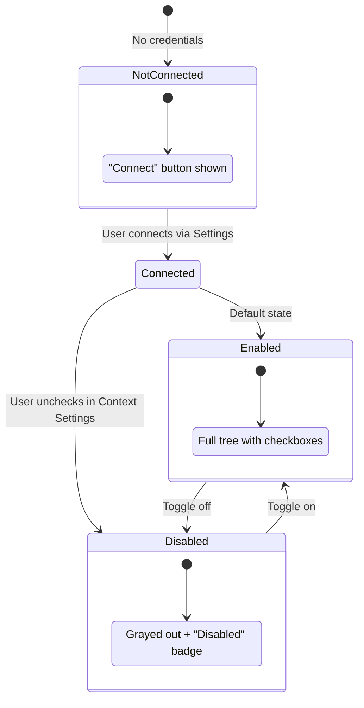

**UI State Matrix:**

| State | UI Display | Agent Behavior | Context Settings |
|-------|------------|----------------|------------------|
| **Not Connected** | Not shown (or "Connect" CTA) | Tools unavailable, prompts to connect | N/A |
| **Connected + Enabled** | Tree view with checkboxes | Tools available, entities in scope | Visible with apps |
| **Connected + Disabled** | Grayed + "Disabled" badge | Tools unavailable for this provider | Collapsed, unchecked |
| **Coming Soon** | "Soon" badge | N/A | Not interactive |

**Source:** `frontend/src/components/chat/context-settings.tsx` (lines 131-134, 298-299, 352-356)

### 8.4 Context Settings

Users control which networks and accounts are active via the Context Settings panel in the sidebar.

```typescript
// Source: frontend/src/lib/chat-settings.ts

interface ChatSettingsState {
  enabledNetworkIds: string[]              // Networks user has enabled
  enabledAccountIds: Record<string, string[]>  // Per-network account selection
  safeMode: boolean                        // Blocks write operations
}
```

**Behavior by Network State:**

| Network State | Agent Behavior | Tool Execution |
|---------------|----------------|----------------|
| **Connected + Enabled** | Normal operation | ✅ Allowed |
| **Connected + Disabled** | 🚫 Block: "AppLovin is disabled. Enable it in Context Settings." | ❌ Blocked |
| **Not Connected** | 🔗 "Unity isn't connected yet. [Connect Unity →]" | ❌ Blocked |
| **Coming Soon** | 💬 "This network isn't available yet." | ❌ N/A |

**Not Connected → Deep Link to Settings:**

```
User: "Show my Unity placements"
Agent: "I can help with that, but Unity isn't connected yet.
       [Connect Unity →]"

       Button links to: /settings/networks?connect=unity&return=/chat/{session_id}
```

The agent provides a deep link to Settings (see Section 4.3 for full flow). This applies to all 9 networks regardless of auth type (OAuth or API key).

**Networks:** AdMob, GAM, AppLovin, Unity, Mintegral, Liftoff, InMobi, Pangle, DT Exchange.

### 8.5 UI Implementation Details

#### Event Types for Network State Handling

The agent sends different SSE event types based on network state. **CTAs appear in the final answer, NOT in chain of thought.**

```typescript
// Source: frontend/src/lib/types.ts (proposed additions)

export type StreamEventItem =
  // ... existing types ...
  | { type: "result"; content: string }  // Final answer text
  | {
      type: "action_required";           // NEW: Actionable prompt
      action: "connect_network" | "enable_network";
      network: string;
      message: string;
      deep_link?: string;                // For connect_network
    }
```

#### UI Placement by Scenario

| Scenario | Chain of Thought | Final Answer | UI Element |
|----------|------------------|--------------|------------|
| **Connected + Enabled** | "Calling Unity API..." | Tool results + response | Normal flow |
| **Connected + Disabled** | "Unity is disabled, blocking" | 🚫 Block text | Text only (panel visible in sidebar) |
| **Not Connected** | "Checking Unity... not found" | Text + Button | `[Connect Unity →]` styled button |
| **Coming Soon** | — | 💬 Explanation text | Just text |

#### Rendering Examples

**Not Connected → Button in Final Answer:**

```
┌─────────────────────────────────────────────────────────┐
│ Chain of Thought (collapsed by default)                 │
│ ├─ 🔀 Routing: inventory/reactive                       │
│ ├─ 🔍 Checking connected networks...                    │
│ └─ ❌ Unity not connected                               │
├─────────────────────────────────────────────────────────┤
│ Final Answer                                            │
│                                                         │
│ I can help you view Unity placements, but Unity isn't   │
│ connected yet.                                          │
│                                                         │
│ ┌─────────────────────┐                                 │
│ │  Connect Unity  →   │  ← Styled button                │
│ └─────────────────────┘                                 │
│                                                         │
│ Once connected, I'll be able to fetch your placements.  │
└─────────────────────────────────────────────────────────┘
```

**Disabled → Block Message:**

```
┌─────────────────────────────────────────────────────────┐
│ Chain of Thought                                        │
│ ├─ 🔀 Routing: reporting/reactive                       │
│ ├─ 🔍 Checking context settings...                      │
│ └─ 🚫 AppLovin disabled                                 │
├─────────────────────────────────────────────────────────┤
│ Final Answer                                            │
│                                                         │
│ 🚫 AppLovin is disabled in your Context Settings.       │
│                                                         │
│ To query AppLovin data, enable it in the Context        │
│ Settings panel in the sidebar.                          │
│                                                         │
│ (No button needed - panel is visible in sidebar)        │
└─────────────────────────────────────────────────────────┘
```

#### Button Component Specification

```typescript
// Frontend component for connect button
interface ConnectNetworkButton {
  network: string;           // "unity", "applovin", etc.
  returnUrl: string;         // Current chat URL for return
  variant: "primary" | "secondary";
}

// Rendered as:
<Button
  onClick={() => router.push(
    `/settings/networks?connect=${network}&return=${encodeURIComponent(returnUrl)}`
  )}
>
  Connect {networkDisplayName} →
</Button>
```

#### Why NOT in Chain of Thought?

1. **Semantic clarity**: Chain of thought shows *reasoning*, not *actions*
2. **Scroll behavior**: Chain of thought may collapse/scroll; CTAs should be visible
3. **Accessibility**: Final answer is the primary interaction zone
4. **Testing**: Easier to assert button presence in predictable location

#### MCP Servers for Debugging

Claude has access to two MCP servers for interactive debugging:

##### 1. Chrome DevTools MCP (26 tools)

**Source:** [chrome-devtools-mcp](https://github.com/AjayNandoriya/chrome-devtools-mcp) | [Documentation](https://developer.chrome.com/blog/chrome-devtools-mcp)

| Category | Tools | Use Case |
|----------|-------|----------|
| **Network Debugging** | `list_network_requests`, `get_network_request` | Inspect API calls, SSE events, check CORS issues |
| **Console** | `list_console_messages` | View errors, warnings, debug logs |
| **Navigation** | `navigate_page`, `new_page`, `select_page`, `close_page` | Open app, switch between pages |
| **Input** | `click`, `fill`, `fill_form`, `hover`, `upload_file` | Interact with UI, test forms |
| **Snapshots** | `take_screenshot`, `take_snapshot` | Capture UI state, DOM for analysis |
| **Scripts** | `evaluate_script` | Run JS in browser console |
| **Emulation** | `emulate_network`, `emulate_cpu`, `resize_page` | Test different conditions |
| **Performance** | `performance_start_trace`, `performance_stop_trace`, `performance_analyze_insight` | Profile page load |

##### 2. LangSmith MCP Server

**Source:** [langsmith-mcp-server](https://github.com/langchain-ai/langsmith-mcp-server)

| Category | Tools | Use Case |
|----------|-------|----------|
| **Traces** | `fetch_runs`, `list_projects` | View agent execution traces, node sequence |
| **Prompts** | `list_prompts`, `get_prompt_by_name`, `push_prompt` | Inspect/manage prompt templates |
| **Datasets** | `list_datasets`, `list_examples`, `read_dataset`, `read_example` | View test datasets |
| **Experiments** | `list_experiments`, `run_experiment` | View evaluation results |

#### Debugging Workflow

```
1. Issue detected (error, wrong behavior)
2. Add temporary debug logs:
   - Frontend: console.log('[DEBUG] ...')
   - Backend: logger.debug('[DEBUG] ...')
3. Use Chrome DevTools MCP:
   - navigate_page → Open the app
   - list_network_requests → Check API calls
   - list_console_messages → View errors/logs
   - take_screenshot → Capture UI state
4. Use LangSmith MCP:
   - list_projects → Find the project
   - fetch_runs → Get recent traces
   - Analyze node execution, prompts, tool calls
5. Identify root cause
6. Fix the issue
7. Remove temporary debug statements
8. Verify fix via both MCPs
```

**Temporary Debug Logging (remove after fix):**

```python
# Backend: LangGraph nodes
import logging
logger = logging.getLogger(__name__)

def entity_loader(state: GraphState) -> GraphState:
    logger.debug(f"[DEBUG] Incoming state: {state}")
    # ... node logic
    logger.debug(f"[DEBUG] Loaded entities: {entities}")
    return state
```

```typescript
// Frontend: React components
useEffect(() => {
  console.log('[DEBUG] Provider state:', providers);
  console.log('[DEBUG] Enabled networks:', enabledNetworkIds);
}, [providers, enabledNetworkIds]);
```

**Key Debug Points:**

| Layer | What to Log | File Location |
|-------|-------------|---------------|
| SSE Stream | Event types, payloads | `chat_server.py` |
| Router Node | Classification result, path selection | `graph/nodes/router.py` |
| Entity Loader | Fetched entities, network state | `graph/nodes/entity_loader.py` |
| Tool Executor | Tool params before/after transform | `graph/nodes/tool_executor.py` |
| Frontend Stream | Parsed events, state updates | `chat-container.tsx` |
| Context Settings | Enabled networks, selection changes | `context-settings.tsx` |

#### Verification Checklist

After fixing, verify with both MCPs:

| Check | Chrome DevTools MCP | LangSmith MCP |
|-------|---------------------|---------------|
| Network not connected | `take_screenshot` → Button visible | `fetch_runs` → No tool nodes |
| Network disabled | `list_console_messages` → No errors | `fetch_runs` → Blocked at router |
| Connected + Enabled | `list_network_requests` → API calls made | `fetch_runs` → Tools executed |
| Deep link correct | `take_snapshot` → Check href | N/A |

### 8.6 Required API Endpoints

#### Provider Management

| Method | Endpoint | Purpose |
|--------|----------|---------|
| `GET` | `/api/providers` | List connected providers (OAuth) |
| `POST` | `/api/providers/connect` | Initiate OAuth flow |
| `DELETE` | `/api/providers/:id` | Disconnect provider |
| `PATCH` | `/api/providers/:id/enable` | Toggle enabled status |
| `GET` | `/api/providers/:id/apps` | List apps for provider |

#### Network Credentials (P-154)

| Method | Endpoint | Purpose |
|--------|----------|---------|
| `GET` | `/api/networks` | List network credential status |
| `POST` | `/api/networks/:network` | Save network credentials |
| `DELETE` | `/api/networks/:network` | Remove network credentials |
| `POST` | `/api/networks/:network/test` | Test connection (optional) |

#### Internal (Agent Use)

| Method | Endpoint | Purpose |
|--------|----------|---------|
| `GET` | `/api/internal/entities` | Fetch entities for grounding |
| `GET` | `/api/internal/credentials/:network` | Fetch decrypted credentials (JIT) |

---

## 9. Security & Compliance

### 9.1 Compliance Certifications

ADAgentAI uses [Neon](https://neon.com) as the PostgreSQL provider. Neon maintains:

| Certification | Status | Relevance |
|---------------|--------|-----------|
| **SOC 2 Type 2** | Certified | Security, Availability, Confidentiality |
| **ISO 27001** | Certified | Information Security Management |
| **ISO 27701** | Certified | Privacy Information Management |
| **GDPR** | Compliant | EU data protection |
| **CCPA** | Compliant | California privacy |

**Source:** [Neon Compliance](https://neon.com/docs/security/compliance)

### 9.2 Encryption at Rest

| Layer | Method | Details |
|-------|--------|---------|
| **Neon Storage** | AES-256 | Hardware-accelerated on NVMe |
| **Application Layer** | AES-256-GCM | For `network_credentials.credentials` |
| **OAuth Tokens** | JWE (AES-256) | Using `BETTER_AUTH_SECRET` |

```python
# Application-layer encryption for API keys
from cryptography.hazmat.primitives.ciphers.aead import AESGCM
import os

def encrypt_credentials(credentials: dict, key: bytes) -> bytes:
    """Encrypt credentials using AES-256-GCM."""
    nonce = os.urandom(12)
    aesgcm = AESGCM(key)
    plaintext = json.dumps(credentials).encode()
    ciphertext = aesgcm.encrypt(nonce, plaintext, None)
    return nonce + ciphertext  # Store as single blob

def decrypt_credentials(encrypted: bytes, key: bytes) -> dict:
    """Decrypt credentials using AES-256-GCM."""
    nonce = encrypted[:12]
    ciphertext = encrypted[12:]
    aesgcm = AESGCM(key)
    plaintext = aesgcm.decrypt(nonce, ciphertext, None)
    return json.loads(plaintext)
```

**Key Management:**
- Encryption key derived from `ENCRYPTION_SECRET` environment variable
- Consider AWS Secrets Manager or HashiCorp Vault for production
- Key rotation policy: Quarterly or on suspected compromise

**Source:** [Neon Security Overview](https://neon.com/docs/security/security-overview)

### 9.3 Encryption in Transit

| Channel | Protocol | Notes |
|---------|----------|-------|
| **Client → API** | TLS 1.3 | Enforced by Vercel/CDN |
| **API → Neon** | TLS 1.2/1.3 | `verify-full` SSL mode |
| **API → MCP Servers** | stdio/IPC | Local process, no network |

### 9.4 Just-in-Time Token Injection

OAuth tokens and API keys are **never** stored in LangGraph state:

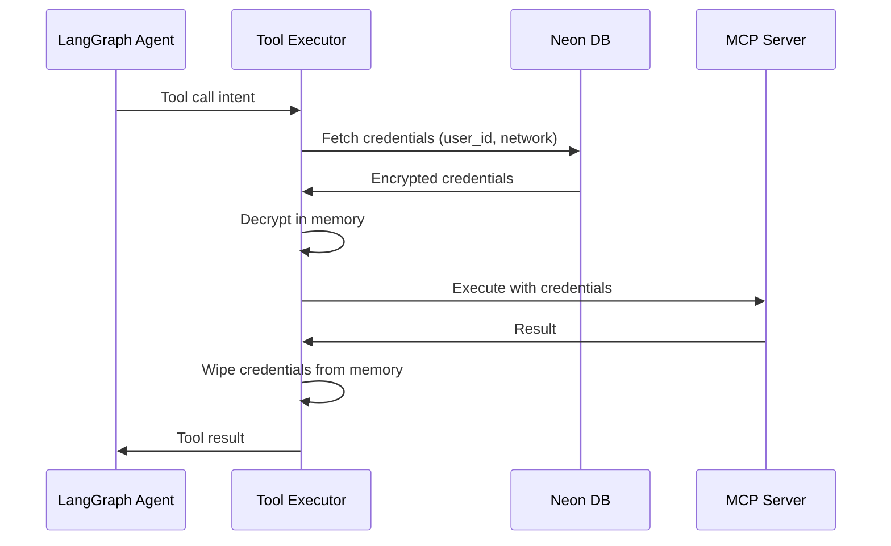

**Security Principles:**
1. Credentials fetched immediately before MCP execution
2. Decrypted only in tool executor scope
3. Wiped from memory after tool completes
4. Never logged, never in graph state, never in prompts

### 9.5 GDPR Compliance

#### Data Subject Rights

| Right | Implementation |
|-------|----------------|
| **Access** | `/api/account/export` - Download all user data |
| **Rectification** | `/api/account/profile` - Update profile |
| **Erasure** | `/api/account/delete` - Full account deletion |
| **Portability** | Export includes chat history, settings |

#### Data Deletion Process

From `backend/api/src/db/schema.ts`:

```sql
-- Stores ONLY aggregate, non-personal data
CREATE TABLE deleted_users (
  id UUID PRIMARY KEY,
  anonymous_id TEXT NOT NULL UNIQUE,  -- NOT the original user ID

  -- Aggregate metrics (no PII)
  account_created_at TIMESTAMP,
  account_deleted_at TIMESTAMP DEFAULT NOW(),
  account_lifetime_days INTEGER,
  total_chat_sessions INTEGER DEFAULT 0,
  total_messages INTEGER DEFAULT 0,

  -- Product engagement (non-personal)
  had_connected_providers BOOLEAN DEFAULT false,
  deletion_reason VARCHAR(50)  -- 'user_requested', 'gdpr_request'
);
```

**Deletion cascade:**
1. Delete `chat_sessions` + `messages`
2. Delete `connected_providers` + `network_credentials`
3. Delete `user_preferences` + `user_provider_preferences`
4. Create anonymized record in `deleted_users`
5. Delete user from auth system

### 9.6 Audit Logging

```sql
-- Admin access audit trail
CREATE TABLE admin_audit_log (
  id UUID PRIMARY KEY,
  admin_user_id TEXT NOT NULL,
  action VARCHAR(100) NOT NULL,  -- 'view_conversation', 'view_logs'
  target_user_id TEXT,
  target_resource_id TEXT,
  metadata JSONB,
  created_at TIMESTAMP DEFAULT NOW()
);
```

**Logged Actions:**
- Admin viewing user conversations
- Admin accessing user logs
- System config changes
- Credential access (for debugging)

### 9.7 Password & Access Security

| Control | Implementation |
|---------|----------------|
| **Neon Password** | 60-bit entropy minimum (1.15 quintillion combinations) |
| **SSL Mode** | `verify-full` (certificate + hostname verification) |
| **OAuth Tokens** | Encrypted at rest, short-lived access tokens |
| **API Keys** | Stored encrypted, never in URLs or logs |

---

## 10. Acceptance Criteria

### 10.1 Functional Criteria

| ID | Requirement | Verification Method |
|----|-------------|---------------------|
| F1 | Router classifies queries with >95% accuracy | LangSmith dataset eval |
| F2 | Specialist selects correct tool in first attempt >80% | LangSmith dataset eval |
| F3 | Write operations trigger approval interrupt | Manual verification (Chrome DevTools MCP) |
| F4 | Denied approvals do not execute tools | Manual verification (LangSmith trace) |
| F5 | Validation errors return guidance to LLM for retry | Manual verification (LangSmith trace) |
| F6 | Invalid entity IDs blocked before approval form | Manual verification |
| F7 | Entities are grounded (no hallucinated IDs) | Validation + manual test |
| F8 | Reactive path uses Haiku model | Config assertion |
| F9 | Workflow path uses Sonnet model | Config assertion |
| F10 | Progress events emitted during tool execution | Manual verification (SSE stream) |

### 10.2 Security Criteria

| ID | Requirement | Verification Method |
|----|-------------|---------------------|
| S1 | Tokens never in graph state | Code review |
| S2 | Tokens encrypted at rest | DB inspection |
| S3 | JIT token injection only | Code review |
| S4 | Token wiped after tool execution | Code review |
| S5 | Org providers only accessible by members | Manual verification |

### 10.3 Quality Criteria

| ID | Requirement | Target |
|----|-------------|--------|
| Q1 | Test coverage | >80% |
| Q2 | LangSmith E2E pass rate | >90% |
| Q3 | No critical Sentry errors | 0 in 24h |

---

## 11. Reference Mapping

### 11.1 Source Documents

| Document | Path | Sections Used |
|----------|------|---------------|
| Agent Architecture | `claude_idea.md` | All sections |
| Data Transformation | `backend/api_specs/logic_mapping.md` | All sections |
| User Journeys | `backend/api_specs/user_journey_2026-01-24.md` | All sections |
| Database Schema | `backend/api/src/db/schema.ts` | organizations, members, connectedProviders, deletedUsers |
| MCP Loader | `backend/chat/tools/loader.py` | SUPPORTED_NETWORKS |
| Router Node | `backend/chat/graph/nodes/router.py` | ROUTE_MAP |
| Context Settings UI | `frontend/src/components/chat/context-settings.tsx` | Provider tree, visibility states |
| Chat Settings Hook | `frontend/src/lib/chat-settings.ts` | ContextMode, enabledProviderIds |
| Frontend Types | `frontend/src/lib/types.ts` | Provider, ProviderApp interfaces |

### 11.2 Linear Issues

| Issue | Title | Sections |
|-------|-------|----------|
| [P-154](https://linear.app/kvlabs/issue/P-154) | Network Configuration UI | Section 8.2, 8.5 |

### 11.3 External Documentation

| Topic | URL | Used In |
|-------|-----|---------|
| LangGraph Interrupts | https://langchain-ai.github.io/langgraph/concepts/human_in_the_loop/ | Section 5.2 |
| LangGraph Command | https://langchain-ai.github.io/langgraph/reference/types/ | Section 5.3 |
| LangGraph StateGraph | https://langchain-ai.github.io/langgraph/concepts/low_level/ | Section 5.5 |
| LangChain configurable_alternatives | https://python.langchain.com/docs/how_to/configure/ | Section 2.3 |
| Pydantic model_validator | https://docs.pydantic.dev/latest/concepts/validators/ | Section 3.2 |
| Pydantic model_serializer | https://docs.pydantic.dev/latest/concepts/serializers/ | Section 3.2 |
| Chrome DevTools MCP | https://github.com/AjayNandoriya/chrome-devtools-mcp | Section 8.5 |
| LangSmith Datasets | https://docs.langchain.com/langsmith/manage-datasets-programmatically | Section 6.3 |
| LangSmith Evaluation | https://docs.langchain.com/langsmith/evaluation | Section 6.4 |
| Neon Security Overview | https://neon.com/docs/security/security-overview | Section 9.2, 9.3 |
| Neon Compliance | https://neon.com/docs/security/compliance | Section 9.1 |

### 11.4 Context7 Library References

| Library | ID | Used For |
|---------|-----|----------|
| LangGraph | `/llmstxt/langchain-ai_github_io_langgraph_llms-full_txt` | Interrupt, Command, State patterns |
| LangSmith | `/websites/langchain_langsmith` | Evaluation, datasets, tracing |
| Pydantic | `/llmstxt/pydantic_dev_llms-full_txt` | model_validator, model_serializer, TypeAdapter |

---

## Appendix A: SSE Event Types

| Event | Purpose | Payload |
|-------|---------|---------|
| `routing` | Query classification | `{service, capability, thinking}` |
| `status` | Progress update | `{label}` |
| `agent` | Agent transition | `{agent_name}` |
| `thought` | Reasoning step | `{content}` |
| `tool` | Tool call initiated | `{name, args}` |
| `tool_result` | Tool completed | `{result}` |
| `tool_approval_required` | Needs approval | `{approval_id, form_schema}` |
| `tool_executing` | Tool running | `{name}` |
| `error` | Error occurred | `{message, code}` |
| `result` | Final response chunk | `{content}` |
| `done` | Stream complete | `{}` |

---

## Appendix B: Provider Protocol (Future)

```python
from abc import ABC, abstractmethod
from typing import Protocol

class AdNetworkProvider(Protocol):
    """Protocol for all ad network providers."""

    @property
    def name(self) -> str: ...

    @property
    def auth_type(self) -> str: ...

    @abstractmethod
    async def list_accounts(self, token: str) -> list[dict]: ...

    @abstractmethod
    async def list_apps(self, token: str, account_id: str) -> list[dict]: ...

    @abstractmethod
    async def list_ad_units(self, token: str, app_id: str) -> list[dict]: ...

    @abstractmethod
    def get_tool_prefix(self) -> str: ...
```

---

**End of Specification**

*This document combines architecture, transformation, and journey specifications into a single source of truth for ADAgentAI implementation.*
