# ADAgentAI Agent Architecture Proposal

**Author:** Claude
**Date:** 2026-01-24
**Based on:** [agent_research_2026-01-23.md](backend/api_specs/agent_research_2026-01-23.md)

---

## Executive Summary

This document proposes a production-grade agent architecture for ADAgentAI that addresses the core challenges identified in the research:

1. **~283 tools across 9 ad networks** - Too many tools degrade LLM selection accuracy
2. **Multi-step workflows** - Complex operations (create mediation group) require precondition validation
3. **Write operation safety** - Destructive actions need human approval with full context
4. **Schema fragmentation** - Each network uses different terminology (bidding vs waterfall, cpm_mode vs is_bidding)
5. **Reliability at scale** - Need loop control, error classification, and graceful degradation

The proposed architecture uses a **Hierarchical Supervisor + Domain Specialists** pattern with **two-layer tool routing** and **workflow-agent hybrid** execution.

---

## System Architecture Overview

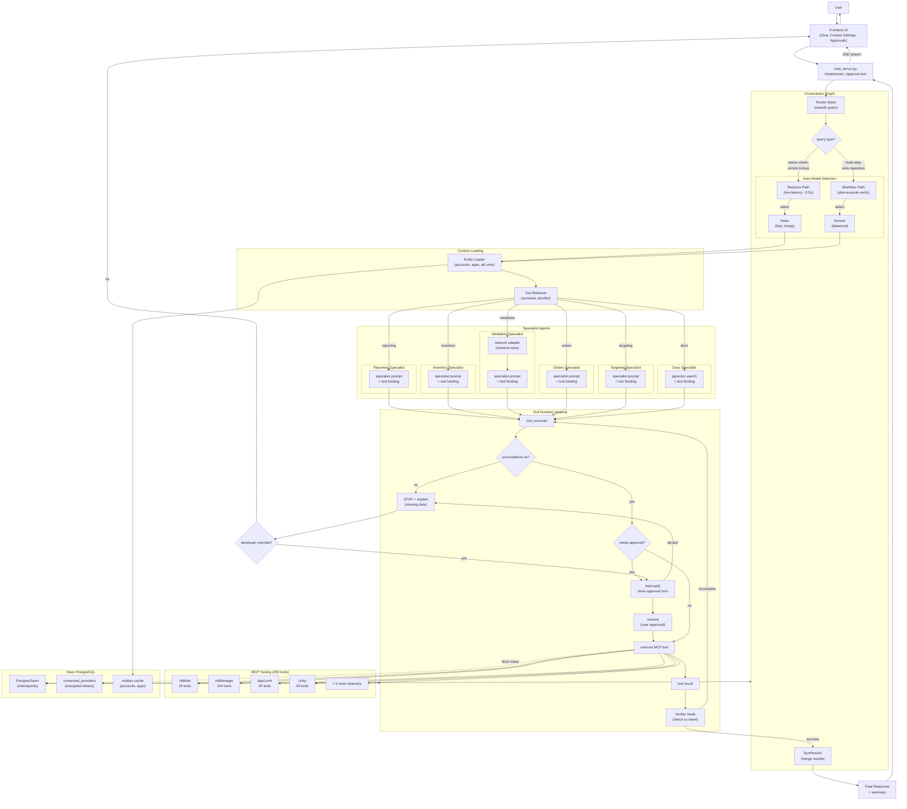

### Dual-Path Routing (Research §11.2)

The router node classifies queries and selects one of two execution paths based on complexity and latency requirements. Each path auto-selects the appropriate model:

| Path | Model | Latency | When Used | Example Queries |
|------|-------|---------|-----------|-----------------|
| **Reactive** | Haiku | ~2-5s | Status checks, simple lookups, read-only queries | "What was my revenue yesterday?", "List my ad units" |
| **Workflow** | Sonnet | ~10-30s | Multi-step operations, write actions, optimization, analysis | "Create a mediation group", "Optimize my mediation setup" |

**Path selection criteria:**
- **Reactive** → Haiku: Single tool call, no writes, no approval needed
- **Workflow** → Sonnet: Multiple tools, writes, precondition checks, or complex analysis

This approach ensures low latency for simple queries while reserving compute for complex ones. Auto-model selection provides significant cost savings compared to using a single model for all queries.

---

## LangGraph StateGraph Definition

This shows the actual LangGraph nodes and conditional edges as they would be implemented:

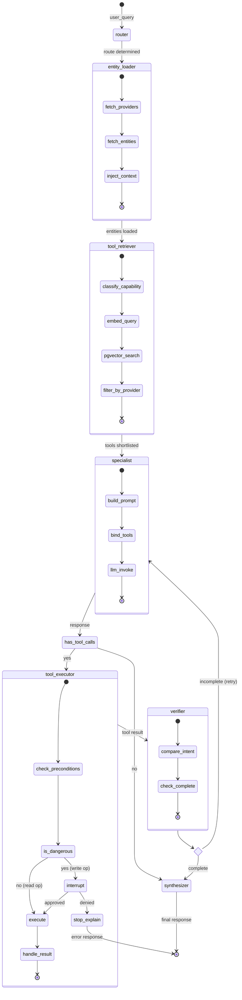

### Graph Nodes

| Node | Function | Input | Output |
|------|----------|-------|--------|
| `router` | Classify intent, complexity, service | user_query | routing dict |
| `entity_loader` | Load user's accounts, apps | user_id | entities in state |
| `tool_retriever` | Shortlist tools via pgvector | capability tag | tool list |
| `specialist` | LLM with bound tools | prompt + tools | response or tool_calls |
| `tool_executor` | Execute MCP tools | tool_calls | tool_results |
| `verifier` | Check result vs intent | tool_results | pass/retry/fail |
| `synthesizer` | Merge results, format response | all results | final response |

### Conditional Edges

```python
# Conditional routing after specialist
def route_after_specialist(state):
    if state.get("tool_calls"):
        return "tool_executor"
    return "synthesizer"

# Conditional routing after verifier
def route_after_verifier(state):
    if state.get("verification_status") == "incomplete":
        return "specialist"  # retry with more context
    return "synthesizer"

# Build the graph
graph = StateGraph(GraphState)
graph.add_node("router", router_node)
graph.add_node("entity_loader", entity_loader_node)
graph.add_node("tool_retriever", tool_retriever_node)
graph.add_node("specialist", specialist_node)
graph.add_node("tool_executor", tool_executor_node)
graph.add_node("verifier", verifier_node)
graph.add_node("synthesizer", synthesizer_node)

graph.add_edge("router", "entity_loader")
graph.add_edge("entity_loader", "tool_retriever")
graph.add_edge("tool_retriever", "specialist")
graph.add_conditional_edges("specialist", route_after_specialist)
graph.add_edge("tool_executor", "verifier")
graph.add_conditional_edges("verifier", route_after_verifier)
graph.add_edge("synthesizer", END)
```

---

## Tool Routing Strategy

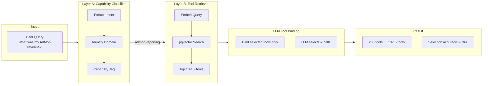

### Capability Tags

| Intent Keywords | Capability Tag | Networks |
|-----------------|----------------|----------|
| revenue, report, earnings, performance | `reporting` | All 9 |
| mediation group, waterfall, bidding | `mediation` | AdMob, AppLovin, Unity |
| ad unit, placement, app, site | `inventory` | All 9 |
| line item, order, creative, trafficking | `orders` | AdManager |
| target, geo, device, audience, segment | `targeting` | AdManager |
| live stream, content, video, cms | `content` | AdManager |
| experiment, A/B test, variant | `experiments` | AdMob, AppLovin |
| help, how to, documentation | `docs` | RAG |

---

## Domain Specialists

Based on actual MCP tool audit (~283 tools across 9 providers):

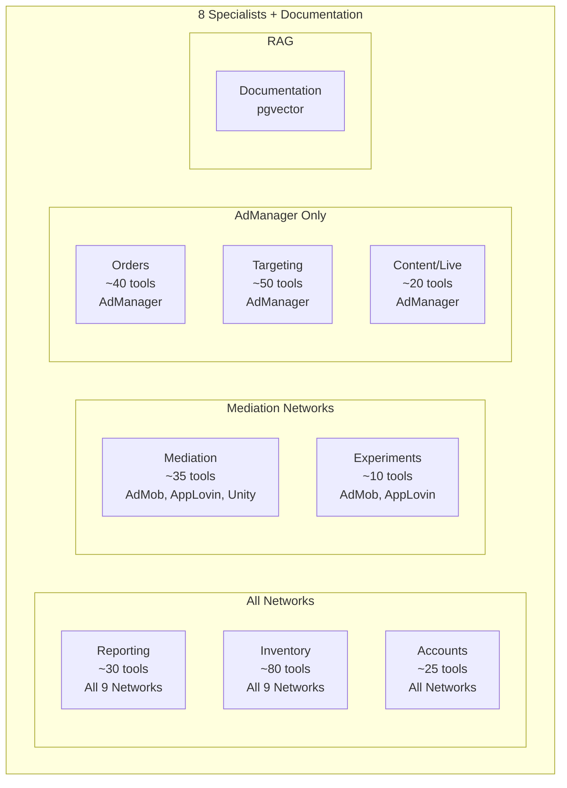

### Tool Distribution by Provider

| Provider | Tools | Primary Capabilities |
|----------|-------|----------------------|
| **AdManager** | 154 | Orders, LineItems, Targeting, Content, Placements |
| **Unity** | 24 | Apps, AdUnits, Mediation Groups, Placements |
| **DT Exchange** | 22 | Apps, Placements, Instances, Reports |
| **AppLovin** | 20 | AdUnits, Waterfall, Experiments, Reports |
| **AdMob** | 19 | Mediation, AdUnits, Apps, A/B Experiments |
| **Mintegral** | 12 | Apps, Placements, AdUnits, Reports |
| **InMobi** | 11 | Apps, Placements, Reports |
| **Pangle** | 11 | Apps, AdSlots, Reports |
| **Liftoff** | 10 | Apps, Placements, Reports |
| **Total** | **~283** | |

### Specialist Mapping

| Specialist | Tools | Networks | Example Operations |
|------------|-------|----------|-------------------|
| **Reporting** | ~30 | All 9 | `mediationReport.generate`, `get_max_report`, `get_monetization_report` |
| **Inventory** | ~80 | All 9 | `adUnits.*`, `apps.*`, `placements.*`, `sites.*` |
| **Accounts** | ~25 | All | `accounts.list`, `networks.list`, `teams.*`, `users.*` |
| **Mediation** | ~35 | AdMob, AppLovin, Unity | `mediationGroups.*`, `waterfall_segment.*`, `mediation_group_v2.*` |
| **Experiments** | ~10 | AdMob, AppLovin | `mediationAbExperiments.*`, `*_experiment` |
| **Orders** | ~40 | AdManager | `lineItems.*`, `orders.*`, `creativeTemplates.*` |
| **Targeting** | ~50 | AdManager | `geoTargets.*`, `customTargetingKeys.*`, `audienceSegments.*` |
| **Content** | ~20 | AdManager | `liveStreamEvents.*`, `content.*`, `contentBundles.*` |
| **Docs** | RAG | N/A | pgvector search over ad network documentation |

---

## Schema Adapter Layer

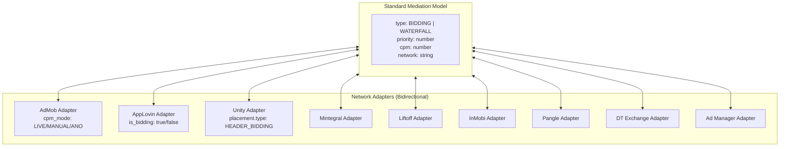

---

## Provider Connection & OAuth

Users must connect their ad network accounts before tools become available. Each network requires its own OAuth flow.

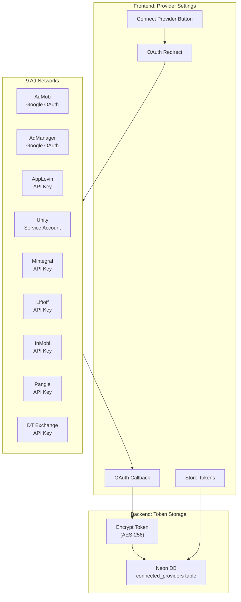

### Provider Connection Status

| Network | Auth Type | Token Storage | Entity Sync |
|---------|-----------|---------------|-------------|
| **AdMob** | Google OAuth 2.0 | Encrypted refresh token | Accounts, Apps, Ad Units |
| **AdManager** | Google OAuth 2.0 | Encrypted refresh token | Networks, Sites, Placements |
| **AppLovin** | API Key + Secret | Encrypted API key | Ad Units, Apps |
| **Unity** | Service Account JSON | Encrypted key file | Apps, Placements, Groups |
| **Mintegral** | API Key + Secret | Encrypted credentials | Apps, Placements |
| **Liftoff** | API Key | Encrypted API key | Apps, Placements |
| **InMobi** | API Key + Secret | Encrypted credentials | Apps, Placements |
| **Pangle** | API Key + Secret | Encrypted credentials | Apps, Ad Slots |
| **DT Exchange** | API Key | Encrypted API key | Apps, Placements |

---

## Tool Scoping by Connected Providers

Tools are **only available** for networks the user has connected. This prevents errors and reduces tool list size.

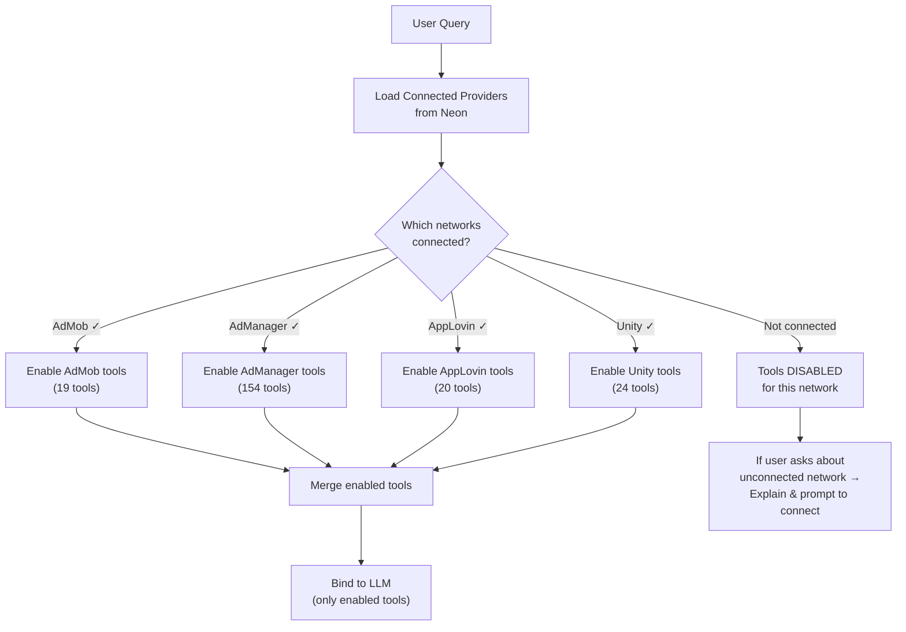

### Tool Availability Rules

| Scenario | Behavior |
|----------|----------|
| User has AdMob connected | AdMob tools (19) available |
| User has AdMob + Unity connected | AdMob (19) + Unity (24) = 43 tools available |
| User asks about AppLovin but not connected | Agent explains: "You need to connect AppLovin first" |
| User has no providers connected | No tools available, agent prompts to connect |

### Implementation: Tool Filtering

```python
# In specialist node - filter tools by connected providers
PROVIDER_TOOL_PREFIXES = {
    "admob": "admob_",
    "admanager": "admanager_",
    "applovin": "applovin_",
    "unity": "unity_",
    "mintegral": "mintegral_",
    "liftoff": "liftoff_",
    "inmobi": "inmobi_",
    "pangle": "pangle_",
    "dtexchange": "dtexchange_",
}

def filter_tools_by_connected_providers(tools, connected_providers):
    """Only return tools for networks user has connected."""
    enabled_prefixes = [
        PROVIDER_TOOL_PREFIXES[p]
        for p in connected_providers
        if p in PROVIDER_TOOL_PREFIXES
    ]
    return [t for t in tools if any(t.name.startswith(p) for p in enabled_prefixes)]
```

---

## Context Settings (Soft/Strict Mode)

Users can control which accounts are in scope via **Context Settings** in the UI.

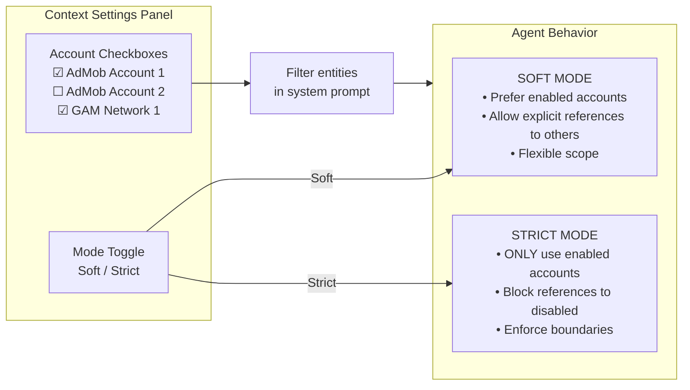

### Context Mode Behavior

| Mode | User says "my account" | User says "account X" (disabled) | Tool calls |
|------|------------------------|----------------------------------|------------|
| **Soft** | Uses first enabled account | Allowed if explicit | Any connected provider |
| **Strict** | Uses first enabled account | Blocked with explanation | Only enabled accounts |

### Entity Injection into System Prompt

```
## Available Entities
STRICT MODE: Only use accounts/entities explicitly enabled by the user.

### Connected Accounts & Apps
- My AdMob Account (admob): pub-1234567890 ✓ ENABLED
  - App: Puzzle Game (ANDROID) - ID: ca-app-pub-xxx~yyy
  - App: Puzzle Game (IOS) - ID: ca-app-pub-xxx~zzz
- Test Account (admob): pub-0987654321 (DISABLED - not in scope)
- Production Network (gam): 12345678 ✓ ENABLED

IMPORTANT: Only use these REAL account and app IDs. Never invent IDs.
```

---

## Entity Grounding (Preventing Hallucinated IDs)

The agent must use **real** account/app/ad unit IDs. Entity grounding prevents the LLM from inventing fake IDs.

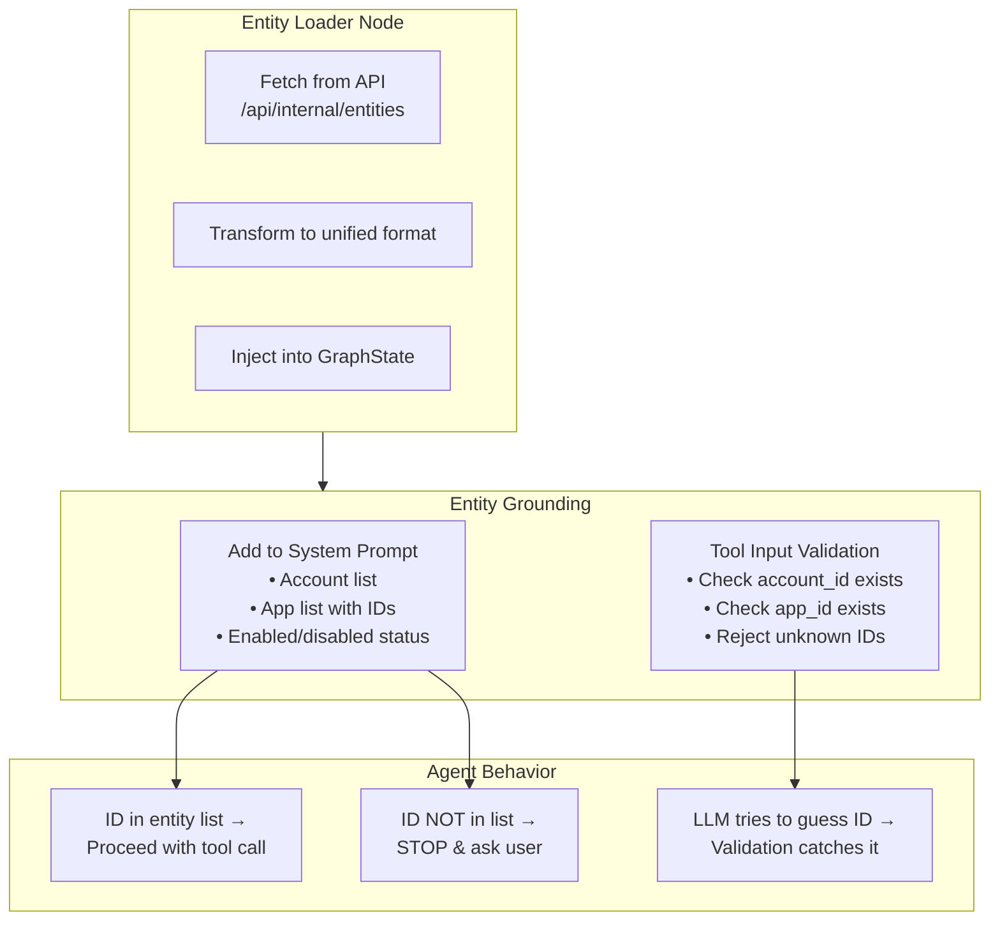

### Entity Data Flow

| Stage | Data | Source |
|-------|------|--------|
| **1. Load** | User's connected providers | `connected_providers` table |
| **2. Fetch** | Accounts, apps, ad units | Each provider's API |
| **3. Cache** | 5-minute server-side cache | Redis/Neon |
| **4. Inject** | Entity list in system prompt | GraphState |
| **5. Validate** | Tool inputs against known IDs | Tool Executor |

---

## Safety & Error Handling

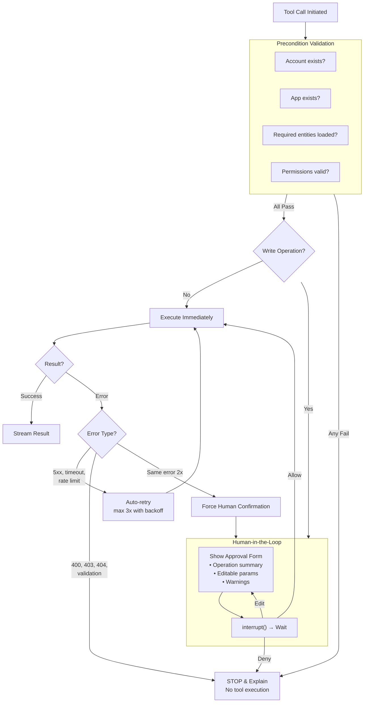

---

## Security: Just-in-Time Token Injection

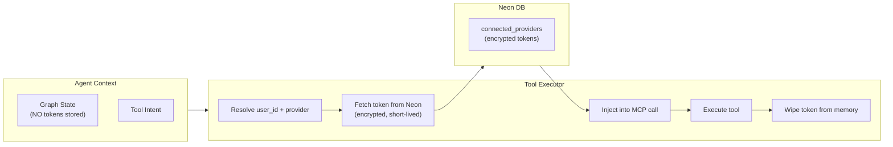

**Security Principles:**
- Tokens are **never** stored in graph state or prompts
- Retrieved **immediately before** MCP execution
- **Wiped from memory** after tool completes
- All tokens encrypted at rest in Neon

---

## Advanced Reasoning: MCTS for Complex Decisions

For high-stakes optimization requests (e.g., "Optimize my mediation setup"), the Supervisor can use **Monte Carlo Tree Search (MCTS)** to simulate outcomes before acting.

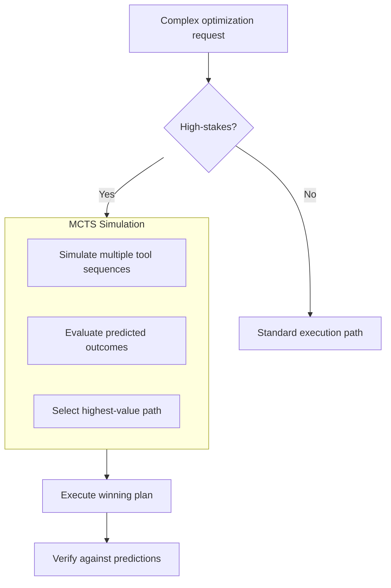

**When to use MCTS:**
- Mediation optimization (bidding vs waterfall tradeoffs)
- Revenue impact predictions
- Multi-network configuration changes

**When NOT to use:**
- Simple queries (use Reactive path)
- Single tool calls
- Time-sensitive operations

---

## Memory Architecture

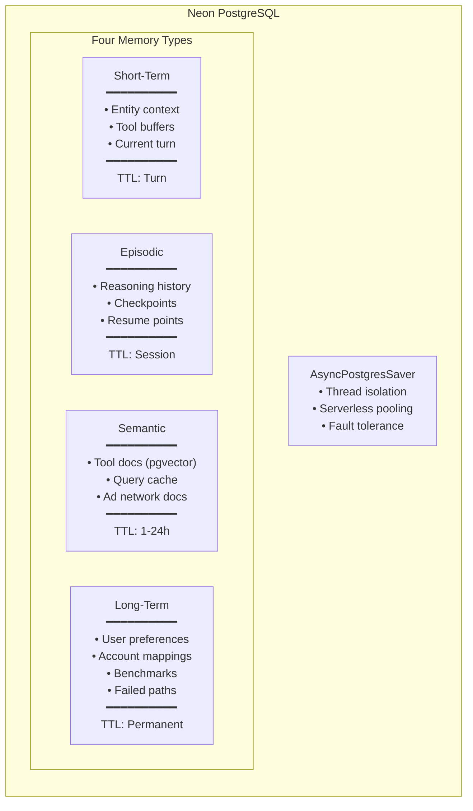

---

## Auto-Model Selection

The architecture supports **dynamic model selection at runtime** based on execution path. This optimizes cost (using cheaper models for simple tasks) while ensuring quality (using capable models for complex workflows).

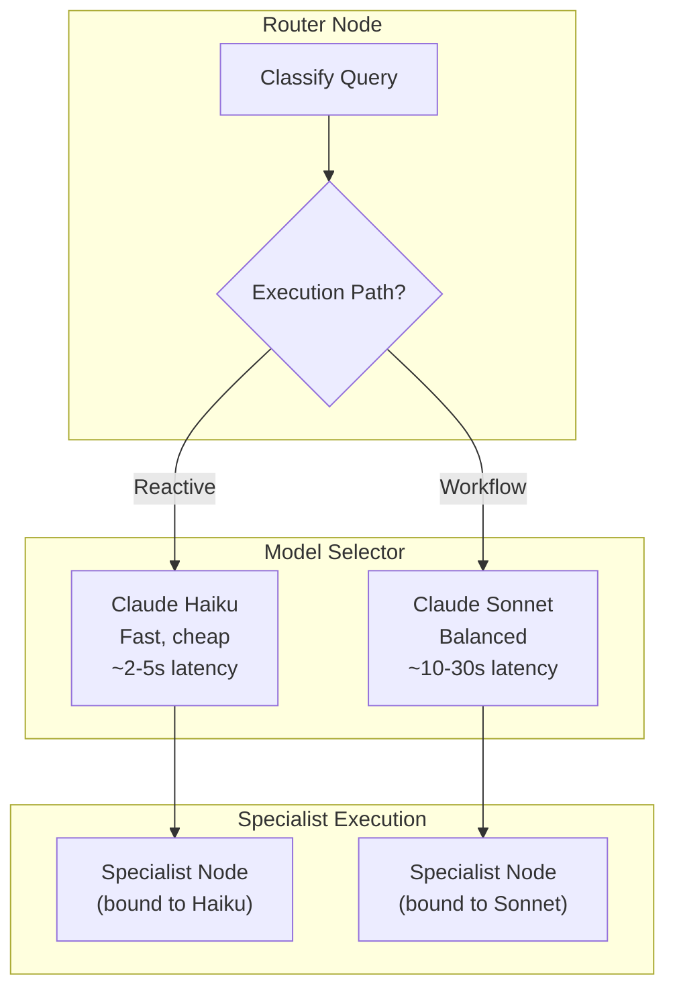

### Model Selection Criteria

| Execution Path | Default Model | When Used | Cost/1M tokens |
|----------------|---------------|-----------|----------------|
| **Reactive** | Claude Haiku | Status checks, simple lookups, read-only | ~$0.25 |
| **Workflow** | Claude Sonnet | Multi-step, writes, optimization, analysis | ~$3.00 |

### LangGraph Implementation

Using LangGraph's `configurable_alternatives` pattern for runtime model switching:

```python
from langchain_anthropic import ChatAnthropic
from langchain_core.runnables import ConfigurableField

# Define model with configurable alternatives
model = ChatAnthropic(
    model="claude-3-5-haiku-20241022"  # Default: fast model
).configurable_alternatives(
    ConfigurableField(id="model_tier"),
    default_key="haiku",
    sonnet=ChatAnthropic(model="claude-sonnet-4-20250514"),
)

# Model selection based on execution path
MODEL_BY_PATH = {
    "reactive": "haiku",
    "workflow": "sonnet",
}

def get_model_config(execution_path: str) -> dict:
    """Return config dict for model selection."""
    return {"configurable": {"model_tier": MODEL_BY_PATH.get(execution_path, "sonnet")}}
```

### Integration with StateGraph

```python
from langgraph.graph import StateGraph

class GraphState(TypedDict):
    messages: list
    execution_path: str  # "reactive" | "workflow"
    model_tier: str      # Derived from execution_path
    # ... other state fields

def router_node(state: GraphState) -> GraphState:
    """Classify query and determine execution path + model tier."""
    # Lightweight classification (always uses Haiku)
    classification = classify_query(state["messages"][-1])

    execution_path = classification["path"]  # reactive/workflow
    model_tier = MODEL_BY_PATH[execution_path]

    return {
        **state,
        "execution_path": execution_path,
        "model_tier": model_tier,
    }

def specialist_node(state: GraphState, config: RunnableConfig) -> GraphState:
    """Execute specialist with dynamically selected model."""
    # Model is automatically selected based on config
    response = model.with_config(
        configurable={"model_tier": state["model_tier"]}
    ).invoke(state["messages"])

    return {**state, "messages": state["messages"] + [response]}

# Build graph with config schema for model selection
graph = StateGraph(GraphState, config_schema=ConfigSchema)
graph.add_node("router", router_node)
graph.add_node("specialist", specialist_node)
# ... add edges
```

### Alternative: init_chat_model (Simpler)

For simpler setups, use LangChain's `init_chat_model` which allows model switching via config string:

```python
from langchain.chat_models import init_chat_model

# Create a model that can be configured at runtime
configurable_model = init_chat_model(configurable_fields="model", temperature=0)

# Use different models via config
configurable_model.invoke(
    messages,
    config={"configurable": {"model": "claude-3-5-haiku-20241022"}}
)

configurable_model.invoke(
    messages,
    config={"configurable": {"model": "claude-sonnet-4-20250514"}}
)
```

### Model Escalation Pattern

For workflows where the initial model fails, implement **model escalation** - start with Haiku and escalate to Sonnet if needed:

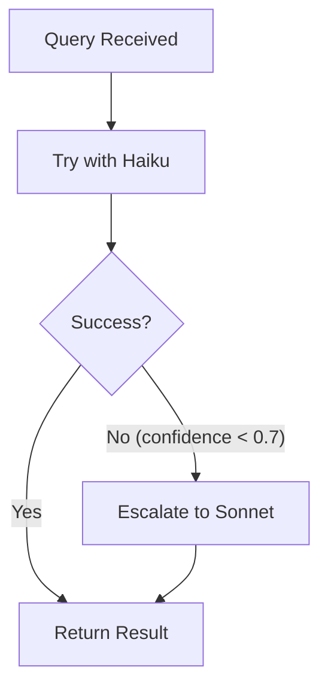

```python
async def escalating_specialist(state: GraphState) -> GraphState:
    """Try cheaper model first, escalate if confidence is low."""
    escalation_chain = ["haiku", "sonnet"]

    for tier in escalation_chain:
        response = await model.with_config(
            configurable={"model_tier": tier}
        ).ainvoke(state["messages"])

        # Check confidence/completeness
        if response.confidence >= 0.7 or tier == "sonnet":
            return {**state, "messages": state["messages"] + [response]}

    return state  # Fallback
```

### Cost Optimization Impact

| Query Type | Before (Sonnet Only) | After (Auto-Model) | Savings |
|------------|----------------------|--------------------|---------|
| Simple status check | $0.003 | $0.00025 | **92%** |
| Multi-step workflow | $0.003 | $0.003 | 0% |
| **Average query** | $0.003 | ~$0.0015 | **~50%** |

---

## User Journey: Simple Query (Reactive)

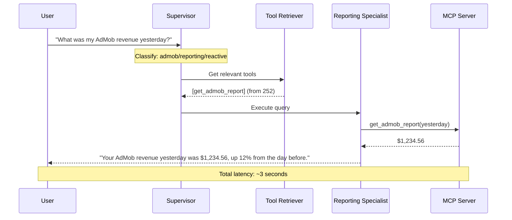

---

## User Journey: Multi-Step Write (Workflow)

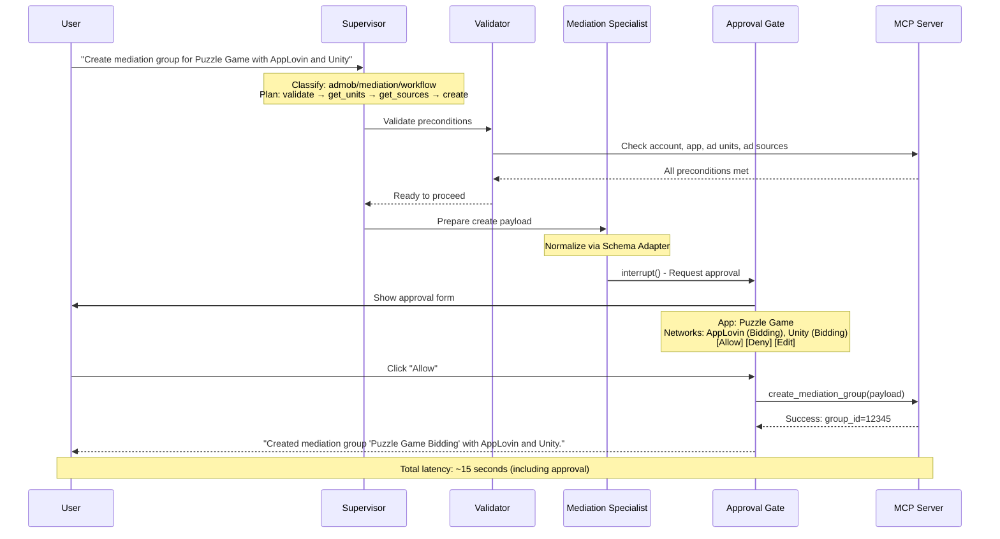

---

## User Journey: Failure Recovery

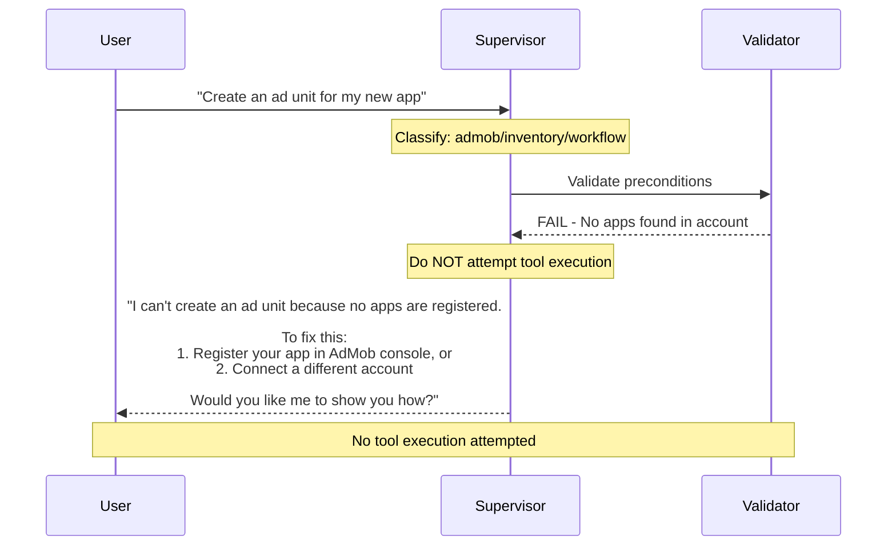

---

## SSE Streaming Events

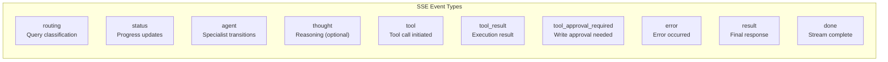

| Event | Purpose | Example Payload |
|-------|---------|-----------------|
| `routing` | Query classification | `{ domain: "admob", intent: "reporting" }` |
| `status` | Granular progress | `{ label: "Fetching ad units..." }` |
| `tool` | Tool call started | `{ name: "get_admob_report", params: {...} }` |
| `tool_approval_required` | Write approval | `{ approval_id: "...", form: {...} }` |
| `result` | Response chunk | `{ content: "Your revenue was..." }` |

---

## Implementation Phases

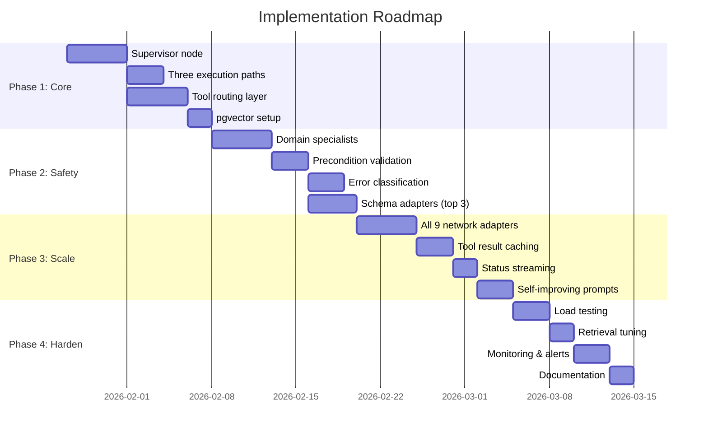

---

## Key Metrics

| Metric | Target | Purpose |
|--------|--------|---------|
| Tool selection accuracy | >95% | Right tools chosen |
| First-tool success rate | >80% | Reduce retries |
| Approval → completion | >90% | Write success |
| Latency (reactive) | <5s | UX |
| Latency (workflow) | <30s | UX |
| Precondition block rate | <10% | Data quality |

---

## Architecture Decisions: Why This Design?

This architecture synthesizes ideas from multiple sources:

| Feature | Source | Why Included |
|---------|--------|--------------|
| **Verifier Node** | Gemini | Quality gate prevents hallucinations, catches incomplete results |
| **Documentation Specialist** | Codex | RAG-based help reduces need for external docs |
| **MCTS for optimization** | Gemini | Simulate before acting on high-stakes decisions |
| **Just-in-Time Tokens** | Gemini | Security best practice - never store creds in state |
| **Two-layer tool routing** | All | Consensus: 252 tools needs semantic filtering |
| **Network adapters** | Codex | Schema normalization before tool selection |
| **Human-in-the-loop** | All | Consensus: Write ops need approval |
| **Three execution paths** | Original | Optimize latency by query complexity |
| **9 specialists** | Enhanced | Cover all ad-tech domains + documentation |

### What We Chose NOT to Include

| Rejected Idea | Source | Why Rejected |
|---------------|--------|--------------|
| Single monolithic graph | - | Too complex, hard to test |
| Tool allowlists only | Codex | Too rigid, semantic retrieval more flexible |
| Separate reactive agent | Gemini | Unified graph with path selection simpler |

---

## Finalized Architecture Components

Summary of all architecture decisions organized by implementation phase:

| Component | Phase 1 | Phase 2 | Phase 3 | Description |
|-----------|:-------:|:-------:|:-------:|-------------|
| **6 Specialists** | ✅ | | | Reporting, Inventory, Mediation, Orders, Targeting, Docs |
| **2 Execution Paths** | ✅ | | | Reactive (fast) + Workflow (multi-step) |
| **4 Memory Types** | ✅ | | | Short-term, Episodic, Semantic, Long-term |
| **Verifier Node** | ✅ | | | Quality gate after tool execution |
| **Auto-Model Selection** | ✅ | | | Haiku (reactive) / Sonnet (workflow) based on path |
| **pgvector Retrieval** | ✅ | | | Semantic tool search (283 → 10-15 tools) |
| **Schema Adapters** | | ✅ | | Network-specific schema normalization |
| **Failure Logging** | ✅ | | | Track failed paths for improvement |
| **Self-Improving Prompts** | | | ✅ | Learn from failure patterns |
| **Optimization Recommendations** | | | ✅ | MCTS-based suggestions for high-stakes decisions |

### Auto-Model Selection Summary

The auto-model feature uses LangGraph's `configurable_alternatives` to dynamically select the appropriate model:

- **Reactive Path** → Claude Haiku (fast, cheap, ~$0.25/1M tokens)
- **Workflow Path** → Claude Sonnet (balanced, ~$3.00/1M tokens)

Estimated **~50% cost savings** compared to using Sonnet for all queries.

---

## References

- [LangGraph Streaming](https://docs.langchain.com/oss/python/langgraph/streaming)
- [LangChain Tool Selection](https://python.langchain.com/docs/how_to/tool_calling/#built-in-tool-selection)
- [LangChain configurable_alternatives](https://python.langchain.com/docs/how_to/configure/) - Runtime model selection
- [LangGraph Runtime Configuration](https://langchain-ai.github.io/langgraphjs/how-tos/configuration/) - config_schema patterns
- [MCP Architecture](https://modelcontextprotocol.io/specification/architecture)
- [Anthropic Multi-Agent Systems](https://www.anthropic.com/news/multi-agent-systems)
- [Full case study analysis](backend/api_specs/agent_research_2026-01-23.md)

### Internal Architecture References
- [codex_idea.md](codex_idea.md) - OpenAI Codex approach (network adapters, QA specialist)
- [gemini_flash_idea.md](gemini_flash_idea.md) - Gemini approach (Verifier node, MCTS, JIT tokens)