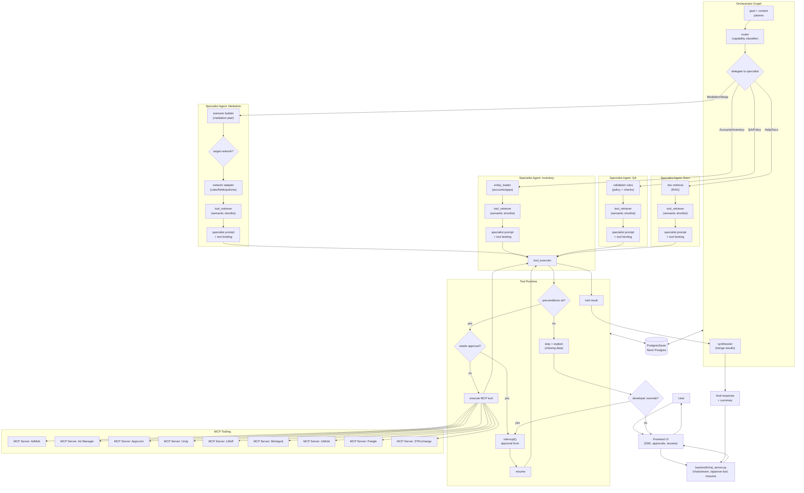

# ADAgentAI Proposed Agent Architecture Diagram

## Graph Overview (Mermaid)


## Flow Notes (concise)
- Orchestrator routes to specialist agents (Inventory, Mediation, QA, Docs).
- Network adapter applies network-specific schemas/policies before tool retrieval.
- Each specialist performs tool retrieval before LLM binding.
- Shared tool runtime enforces preconditions, retry policy, and stop rules.
- interrupt() used for approvals and controlled user edits; resume continues graph.
- PostgresSaver (Neon) persists state across agents for resume/retry and restarts.
- MCP servers provide tool surface; progress notifications can stream to UI.

## Tool Binding with MCP Tools (filtered by task + network)
```python
# Uses your MCP loader + real tool names (from approval/models.py)
from langchain_anthropic import ChatAnthropic
from backend.chat.tools.loader import get_tools_for_service

MEDIATION_TOOL_ALLOWLIST = {
    "admob": {
        "admob_create_mediation_group",
        "admob_update_mediation_group",
        "admob_create_mediation_ab_experiment",
        "admob_stop_mediation_ab_experiment",
        "admob_create_ad_unit_mapping",
        "admob_batch_create_ad_unit_mappings",
    }
}

def _filter_tools_for_task(tools: list, service: str, task: str) -> list:
    if task == "mediation":
        allow = MEDIATION_TOOL_ALLOWLIST.get(service, set())
        return [t for t in tools if t.name in allow]
    return tools

async def build_mediation_llm(service: str, user_id: str):
    tools = await get_tools_for_service(service, user_id)
    tools = _filter_tools_for_task(tools, service, "mediation")
    llm = ChatAnthropic(model="claude-sonnet-4-20250514", max_tokens=8192)
    return llm.bind_tools(tools)
```

## Failure & Control Branches
- Deterministic failure in prerequisites => stop + explain, require user action.
- Retryable failures => bounded retries, then user confirmation.
- Developer override path can open create forms even if prerequisites are missing.
