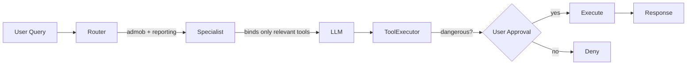
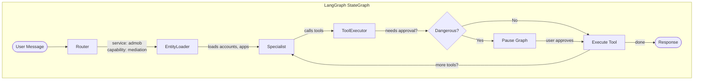
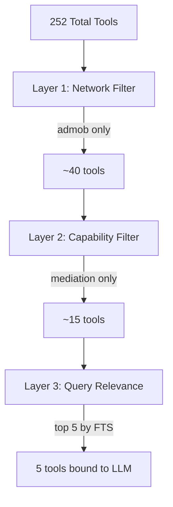
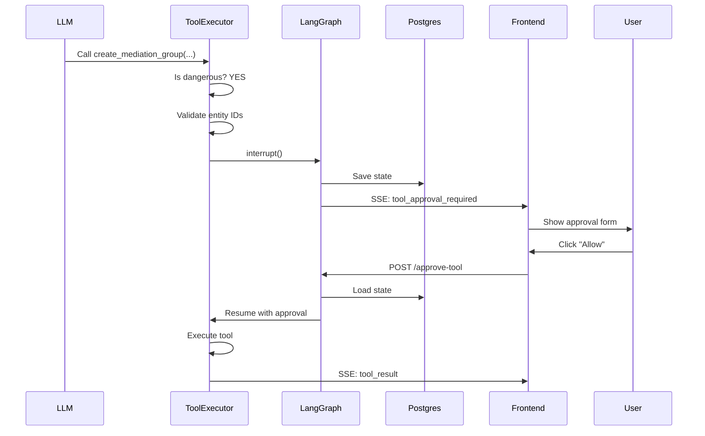
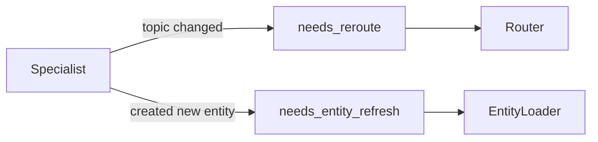

# Agent Architecture

How one agent handles 250+ tools across 9 ad networks.

## The Big Picture



**Key Insight**: We don't load all 250 tools. Router picks a "service + capability" combo, then Specialist loads only ~5-15 relevant tools.

---

## Core Concepts

### Service = Which Ad Network
| Service | What it is |
|---------|------------|
| `admob` | Google AdMob |
| `admanager` | Google Ad Manager |
| `applovin` | AppLovin MAX |
| `unity` | Unity Ads |
| `mintegral` | Mintegral |
| `liftoff` | Liftoff |
| `inmobi` | InMobi |
| `pangle` | Pangle |
| `dtexchange` | DT Exchange |

### Capability = What User Wants To Do
| Capability | Example Tools |
|------------|---------------|
| `inventory` | list_apps, list_ad_units, create_ad_unit |
| `reporting` | generate_network_report, get_metrics |
| `mediation` | list_mediation_groups, create_mediation_group |
| `orders` | list_orders, create_order (Ad Manager) |
| `deals` | list_deals, create_deal (Ad Manager) |

### Execution Path = How Complex Is This?
| Path | Model | When Used |
|------|-------|-----------|
| `reactive` | Claude Haiku (fast) | Simple queries: "list my apps" |
| `workflow` | Claude Sonnet (smart) | Complex: "create mediation group with these settings" |

---

## Graph Flow



### Node Details

| Node | What It Does |
|------|--------------|
| **Router** | Classifies query → picks service + capability |
| **EntityLoader** | Fetches user's accounts, apps, ad units from API |
| **Specialist** | Binds filtered tools to LLM, runs conversation |
| **ToolExecutor** | Executes tools, handles approvals for dangerous ones |

---

## Tool Filtering (The Magic)

How we go from 250 tools to ~5 relevant ones:



**Example**:
- User: "Create a mediation group for my game"
- Router picks: `admob` + `mediation`
- Layer 1: Filter to AdMob tools (40)
- Layer 2: Filter to mediation capability (15)
- Layer 3: FTS finds: `create_mediation_group`, `list_ad_sources`, `list_apps`, etc.

---

## Tool Approval (Dangerous Operations)

### What's Dangerous?
Any tool that **writes data**:
- `create_*` - Creates new resources
- `update_*` / `patch_*` - Modifies existing
- `delete_*` / `remove_*` - Deletes resources
- `batch_*` - Bulk operations

### Approval Flow



### Pre-Approval Validation
Before showing the approval form, we validate:
- Are the entity IDs real? (not hallucinated by LLM)
- Does the user have access to these resources?

If invalid → Error back to LLM to retry with correct IDs.

---

## Backflow (Re-routing)

Sometimes the Specialist needs to go back:



**Example**: User asks about AdMob, then says "actually show me Ad Manager orders". Specialist sets `needs_reroute = True`, graph loops back to Router.

---

## State Structure

```python
class GraphState(TypedDict):
    # Routing
    routing: RoutingState  # {service, capability, execution_path}

    # Context (from EntityLoader)
    available_accounts: list[dict]
    available_apps: list[dict]
    available_ad_units: list[dict]

    # Conversation
    messages: list[BaseMessage]

    # Tool Execution
    tool_calls: list[ToolCall]  # Accumulated with merge-by-ID

    # Control Flow
    needs_reroute: bool
    needs_entity_refresh: bool
```

---

## Quick Reference

| Question | Answer |
|----------|--------|
| How many tools total? | 252 across 9 networks |
| How many bound to LLM? | 5-15 after filtering |
| Which model for simple queries? | Claude Haiku (fast) |
| Which model for complex queries? | Claude Sonnet (with thinking) |
| What triggers approval? | create/update/delete operations |
| Where is state saved? | Postgres (via LangGraph PostgresSaver) |
