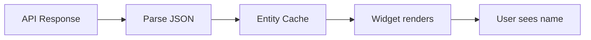
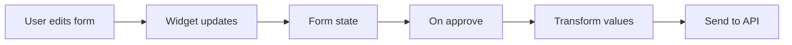
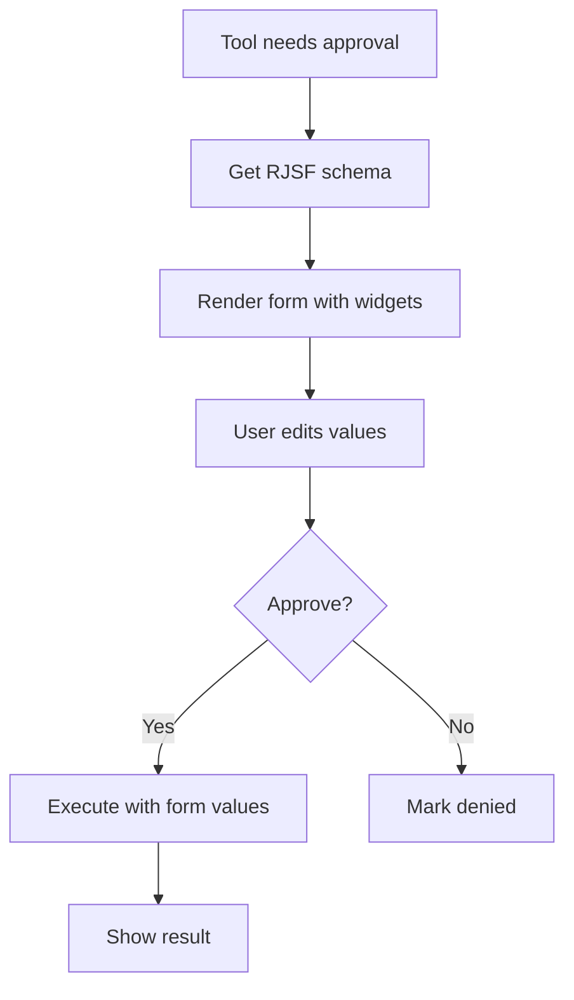

# API Logic Mapping

Detailed reference for how data transforms between backend and frontend.

---

## 1. Widgets Reference

### Widget Registry

| Widget Name | Type | Purpose |
|-------------|------|---------|
| `SelectWidget` | Widget | Basic dropdown (dark themed) |
| `EntitySelectWidget` | Widget | Async dropdown - fetches options from API |
| `MultiSelectWidget` | Widget | Multi-select chips with async fetch |
| `AdSourceSelectWidget` | Widget | Ad source dropdown with network grouping |
| `AdSourceToggleField` | Field | Full ad source picker with bidding/waterfall sections |
| `ToggleWidget` | Widget | Boolean on/off switch |
| `PlatformWidget` | Widget | iOS/Android toggle buttons |
| `RadioWidget` | Widget | Radio button group |
| `CurrencyWidget` | Widget | Dollar input → micros storage |
| `RegionCodesWidget` | Widget | Country/region multi-select |

---

### EntitySelectWidget

**Purpose**: Dropdown that fetches options from API with caching.

**ID ↔ Name Handling**:
```
API returns: [{ id: "pub-123", name: "My Account" }, ...]
Dropdown shows: "My Account"
Selected value stored: "pub-123"
Sent to API: "pub-123"
```

**Account ID Normalization**:
```
LLM sends:     "accounts/pub-123"  (full path)
Widget stores: "pub-123"            (normalized for dropdown matching)
Sent to API:   "accounts/pub-123"   (denormalized back to original format)
```

**Dependency Handling**:

| Scenario | Behavior |
|----------|----------|
| Parent not selected | Shows "Select {parent} first" message |
| Parent changes | Clears current selection, fetches new options |
| Filter changes | Keeps selection if still valid, fetches new options |

**uiSchema Example**:
```json
{
  "account_id": {
    "ui:widget": "EntitySelectWidget",
    "ui:options": {
      "fetchType": "accounts"
    }
  },
  "app_id": {
    "ui:widget": "EntitySelectWidget",
    "ui:options": {
      "fetchType": "apps",
      "dependsOn": "account_id"
    }
  }
}
```

---

### MultiSelectWidget

**Purpose**: Select multiple items as array.

**ID ↔ Name Handling**:
```
API returns:   [{ id: "unit-1", name: "Banner 300x250" }, ...]
User selects:  "Banner 300x250", "Interstitial"
Stored value:  ["unit-1", "unit-2"]
Sent to API:   ["unit-1", "unit-2"]
```

**Filter Cascading** (different from structural dependency):

| Type | Field | Behavior on Change |
|------|-------|-------------------|
| `dependsOn` | Parent entity | Clears selection (all options change) |
| `filterBy` | Filter field | Keeps valid selections (some options remain) |

**uiSchema Example**:
```json
{
  "ad_unit_ids": {
    "ui:widget": "MultiSelectWidget",
    "ui:options": {
      "fetchType": "ad_units",
      "dependsOn": "account_id",
      "filterBy": ["platform", "ad_format"]
    }
  }
}
```

---

### CurrencyWidget

**Purpose**: User enters dollars, API receives micros.

**Conversion**:
```
1 USD = 1,000,000 micros

User enters:   $1.50
Stored value:  1500000 (micros)
Displayed as:  $1.50
Sent to API:   1500000
```

**Features**:
- $ prefix shown
- +/- stepper buttons (step: $0.10 default)
- Max 2 decimal places
- Formats on blur

**uiSchema Example**:
```json
{
  "cpm_floor": {
    "ui:widget": "CurrencyWidget",
    "ui:options": {
      "step": 0.05
    }
  }
}
```

---

### AdSourceToggleField

**Purpose**: Complex ad source picker for mediation group lines.

**Structure**:
```
┌─────────────────────────────────────────┐
│ BIDDING NETWORKS                   2/10 │
│ ☑ AdMob Network                         │
│ ☑ Meta Audience Network                 │
│ ☐ Unity Ads                             │
├─────────────────────────────────────────┤
│ WATERFALL NETWORKS                 1/8  │
│ ☑ ironSource          Fixed $1.50       │
│ ☐ AppLovin                              │
└─────────────────────────────────────────┘
```

**Data Transformation**:

```
API returns ad sources:
[
  { id: "123", name: "AdMob", adapter_type: "BIDDING" },
  { id: "456", name: "ironSource", adapter_type: "WATERFALL" }
]

User selects sources, widget builds lines:
[
  { ad_source_id: "123", state: "ENABLED" },
  {
    ad_source_id: "456",
    state: "ENABLED",
    pricing_mode: "FIXED",
    cpm_floor: 1500000
  }
]

Sent to API: the lines array above
```

**Line Structure by Type**:

| Field | Bidding | Waterfall |
|-------|---------|-----------|
| `ad_source_id` | Required | Required |
| `state` | "ENABLED" | "ENABLED" |
| `pricing_mode` | N/A | "FIXED" or "NETWORK_OPTIMIZED" |
| `cpm_floor` | N/A | Required if FIXED (in micros) |
| `_ad_source_name` | Display only | Display only |

---

### PlatformWidget

**Purpose**: iOS/Android toggle.

**Visual**:
```
[ iOS ]  [ Android ]
   ^selected
```

**Value Mapping**:
```
Left button:  "IOS"
Right button: "ANDROID"
```

---

### RadioWidget

**Purpose**: Single-select from options.

**Visual**:
```
○ BANNER
● INTERSTITIAL  ← selected
○ REWARDED
```

**Value**: The selected enum value string.

---

### RegionCodesWidget

**Purpose**: Country/region targeting.

**Visual**:
```
Selected: [US ×] [CA ×] [GB ×]

Popular: US | CA | UK | DE | FR | AU
All Countries: [searchable dropdown]
```

**Value Handling**:
```
Stored: "US,CA,GB"  (comma-separated string)
Sent to API: "US,CA,GB"
```

---

## 2. Entity Relationships

### Hierarchy

```
accounts (root)
├── apps
├── ad_units
├── ad_sources
├── mediation_groups
├── bidding_ad_sources
└── waterfall_ad_sources

networks (root - Ad Manager)
├── ad_manager_ad_units
├── placements
├── teams
└── contacts
```

### Parent Field Mapping

| Entity Type | Parent Field | Example Value |
|-------------|--------------|---------------|
| `apps` | `account_id` | "pub-123" |
| `ad_units` | `account_id` | "pub-123" |
| `ad_sources` | `account_id` | "pub-123" |
| `mediation_groups` | `account_id` | "pub-123" |
| `ad_manager_ad_units` | `network_code` | "12345678" |
| `placements` | `network_code` | "12345678" |

### ID Patterns

| Entity | Pattern | Example |
|--------|---------|---------|
| AdMob Account | `/^pub-/` | "pub-5533537533538327" |
| AdMob App | `/^ca-app-pub-/` | "ca-app-pub-5533537533538327~1234567890" |
| AdMob Ad Unit | `/^ca-app-pub-.*\/\d+$/` | "ca-app-pub-5533537533538327~1234567890/1234567890" |
| Ad Manager Network | `/^\d+$/` | "12345678" |

---

## 3. Schema → Widget Mapping

### Automatic Mapping (by JSON Schema type)

| JSON Schema | Default Widget | Result |
|-------------|----------------|--------|
| `type: "string"` | TextWidget | Text input |
| `type: "string", enum: [...]` | SelectWidget | Dropdown |
| `type: "boolean"` | CheckboxWidget | Checkbox |
| `type: "integer"` | TextWidget | Number input |
| `type: "number"` | TextWidget | Number input |
| `type: "array", items: {type: "string"}` | - | Text input (comma-sep) |

### Explicit Widget Assignment (uiSchema)

| uiSchema Widget | When Used |
|-----------------|-----------|
| `EntitySelectWidget` | Field needs async entity options |
| `MultiSelectWidget` | Array field needs async entity options |
| `AdSourceToggleField` | `mediation_group_lines` field |
| `CurrencyWidget` | `*_micros`, `cpm_*` fields |
| `PlatformWidget` | `platform` field |
| `RadioWidget` | Enums where radio is better UX |
| `RegionCodesWidget` | `*region_codes`, `targeting_*` |
| `ToggleWidget` | Boolean with toggle preferred |

### Field Name → Widget (in schema_extractor.py)

| Field Pattern | Widget Assigned | fetchType |
|---------------|-----------------|-----------|
| `account_id`, `parent`, `publisher_id` | EntitySelectWidget | accounts |
| `app_id` | EntitySelectWidget | apps |
| `ad_unit_id`, `ad_unit_ids` | EntitySelectWidget/Multi | ad_units |
| `network_code` | EntitySelectWidget | networks |
| `mediation_group_lines` | AdSourceToggleField | ad_sources |
| `platform` | (uses enum with radio) | - |
| `ad_format` | (uses enum with radio) | - |
| `cpm_floor`, `cpm_micros` | CurrencyWidget | - |
| `targeted_region_codes` | RegionCodesWidget | - |

---

## 4. API → UI → API Round Trip

### Read Flow (API → UI)



**Example - Account Selection**:
```
1. API returns: { accounts: [{ name: "pub-123", displayName: "My Game Studio" }] }
2. Cache stores: { id: "pub-123", name: "My Game Studio" }
3. Widget shows dropdown with "My Game Studio"
4. User selects "My Game Studio"
5. Widget stores value: "pub-123"
```

### Write Flow (UI → API)



**Example - Create Mediation Group**:
```
1. User fills form:
   - Account: "My Game Studio" (stored: "pub-123")
   - Name: "iOS Rewarded"
   - Platform: clicks iOS (stored: "IOS")
   - Ad Sources: toggles 3 sources

2. Form state:
   {
     account_id: "pub-123",
     display_name: "iOS Rewarded",
     platform: "IOS",
     mediation_group_lines: [
       { ad_source_id: "1", state: "ENABLED" },
       { ad_source_id: "2", state: "ENABLED" },
       { ad_source_id: "3", state: "ENABLED", pricing_mode: "FIXED", cpm_floor: 1500000 }
     ]
   }

3. Sent to API: exactly the form state above
```

---

## 5. Display Name Resolution

### getDisplayName Logic

```typescript
function getDisplayName(fetchType, id, parentId) {
  // 1. Check cache for this entity
  const cached = cache[fetchType]?.[parentId]?.find(e => e.id === id)
  if (cached) return cached.name

  // 2. Fallback: return ID itself
  return id
}
```

### Where Names Come From

| Entity | Display Field | Example |
|--------|---------------|---------|
| accounts | `name` or `displayName` | "My Game Studio" |
| apps | `name` | "Super Game" |
| ad_units | `displayName` | "Banner 300x250" |
| ad_sources | `name` | "AdMob Network" |
| mediation_groups | `displayName` | "iOS Rewarded Group" |

---

## 6. Parameter Display Names

### Mapping Table

| API Field | Display Label |
|-----------|---------------|
| `account_id` | Account |
| `parent` | Account |
| `app_id` | App |
| `ad_unit_id` | Ad Unit |
| `ad_unit_ids` | Ad Units |
| `network_code` | Network |
| `display_name` | Name |
| `platform` | Platform |
| `ad_format` | Ad Format |
| `pricing_mode` | Pricing |
| `cpm_floor` | CPM Floor |
| `cpm_micros` | CPM (micros) |
| `targeted_region_codes` | Target Regions |
| `excluded_region_codes` | Exclude Regions |
| `mediation_group_lines` | (rendered as ad source picker) |

### Fallback Logic

If field not in mapping:
```
"some_param_name" → "Some Param Name"
(split by _, capitalize each word)
```

---

## 7. Tool Display Mapping

### Tool Name → Category

| Pattern | Category | Icon | Dangerous |
|---------|----------|------|-----------|
| `list_*` | reading | Search | No |
| `get_*` | reading | Search | No |
| `generate_*` | reading | Search | No |
| `*_report` | reading | Search | No |
| `search_*` | searching | FileSearch | No |
| `create_*` | creating | Plus | **Yes** |
| `add_*` | creating | Plus | **Yes** |
| `update_*` | updating | Pencil | **Yes** |
| `patch_*` | updating | Pencil | **Yes** |
| `edit_*` | updating | Pencil | **Yes** |
| `delete_*` | deleting | Trash2 | **Yes** |
| `remove_*` | deleting | Trash2 | **Yes** |
| `archive_*` | deleting | Trash2 | **Yes** |
| `batch_*` | (varies) | (varies) | **Yes** |
| `stop_*` | action | Zap | **Yes** |
| `activate_*` | action | Zap | **Yes** |
| `deactivate_*` | action | Zap | **Yes** |

### Tool Name → Entity

```
admob_list_accounts        → entity: "account"
admob_create_ad_unit       → entity: "ad unit"
admanager_patch_order      → entity: "order"
networks_unity_list_apps   → entity: "app"
```

**Extraction Logic**:
1. Remove prefix: `admob_`, `admanager_`, `networks_*_`
2. Remove operation: `list_`, `create_`, `update_`, etc.
3. Replace `_` with space
4. Remove trailing `s`

### Tool Name → Provider

| Contains | Provider |
|----------|----------|
| `admob` | "AdMob" |
| `admanager` | "Ad Manager" |
| `applovin` | "AppLovin" |
| `unity` | "Unity" |
| `mintegral` | "Mintegral" |
| `liftoff` | "Liftoff" |
| `inmobi` | "InMobi" |
| `pangle` | "Pangle" |
| `dtexchange` | "DT Exchange" |
| *(default)* | "API" |

---

## 8. Result Display

### Summary Extraction

| Result Shape | Summary Text |
|--------------|--------------|
| `[item1, item2, ...]` | "3 items" |
| `{ count: 5 }` | "5 items" |
| `{ items: [...] }` | "{items.length} items" |
| `{ total: 100 }` | "100 total" |
| `{ message: "Done" }` | "Done" |
| `{ success: true }` | "Success" |
| `{ success: false }` | "Failed" |
| `{ name: "created-thing" }` | (show JSON tree) |

### MCP Content Unwrapping

Some tools return wrapped format:
```json
[{ "type": "text", "text": "{\"accounts\": [...]}" }]
```

Extraction:
1. Check if array of `{type, text}` objects
2. Parse `text` field as JSON
3. Return parsed content

---

## 9. Approval States

### State Machine

```
null (pending) → true (approved) → executed
             → false (denied)  → skipped
             → false (cancelled) → new message sent
```

### UI per State

| State | Badge | Form | Buttons |
|-------|-------|------|---------|
| `null` | Yellow "Pending" | Editable | Allow, Deny |
| `true` | Green "Approved" | Readonly | None |
| `false` (denied) | Red "Denied" | Hidden | None |
| `false` (cancelled) | Gray "Cancelled" | Hidden | None |

---

## 10. Vital Flow (Minimal)



**Key transforms in this flow**:
1. Tool args → RJSF schema (schema_extractor.py)
2. Schema + uiSchema → Rendered widgets (RJSF + custom widgets)
3. User selections → IDs (widgets handle name↔id)
4. Form state → API request (direct JSON)
5. API result → Display (JsonTreeView or summary)
