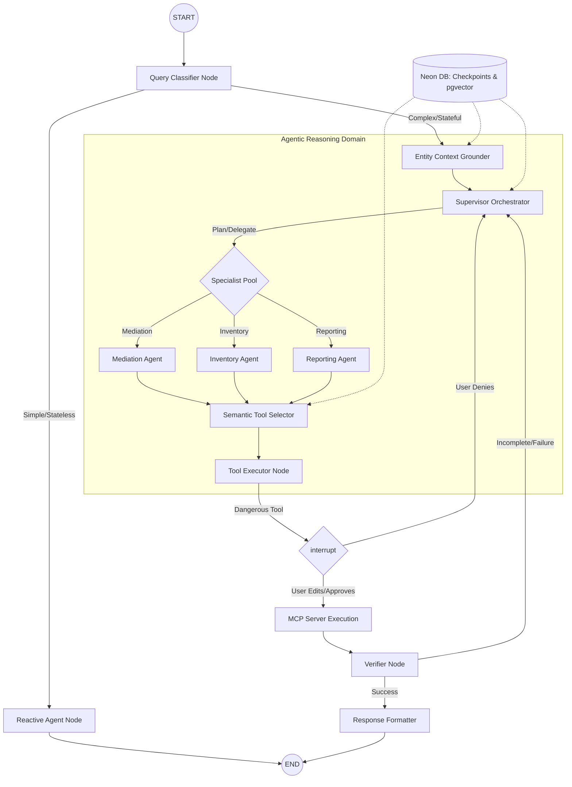

# ADAgentAI: Production Agent Ecosystem Blueprint (v1.0)
**Date:** 2026-01-24
**Subject:** Scalable Hierarchical Multi-Agent Architecture for 250+ Ad-Tech Tools

---

## 1. Architectural Vision: The "Intelligence Mesh"
To move beyond simple ReAct loops, ADAgentAI implements a **Hierarchical Supervisor-Specialist** architecture. This system treats tools as "Dynamic Resources" and reasoning as a "Multi-Stage Workflow."

### 1.1 The "Tool Overload" Solution: Semantic Scoping
With 250+ tools, LLM performance degrades. We solve this via **Three-Layer Scoping**:
1.  **Capability Routing:** The Supervisor directs the task to a specific Subgraph (Mediation, Reporting, etc.).
2.  **Semantic Retrieval:** A middleware layer uses `pgvector` in Neon DB to shortlist the **Top 10-15 tools** based on the current step's intent.
3.  **Active Binding:** Only the shortlisted tools are bound to the LLM's current turn context.

---

## 2. Core LangGraph Topology
This is the definitive graph structure for the ADAgentAI backend.

---

## 3. Node-Level Technical Specification

### 3.1 Supervisor Orchestrator (The "Director")
*   **Responsibility:** Task decomposition, state management, and handoffs.
*   **Logic:** Uses a **Plan-Execute-Verify** cycle. It maintains a "Running Plan" in the graph state.
*   **Advanced Reasoning:** Implements a lightweight **MCTS (Monte Carlo Tree Search)** for high-stakes optimization requests to simulate different mediation outcomes before acting.

### 3.2 Specialist Agents (Mediation, Inventory, Reporting)
*   **Responsibility:** Domain-specific reasoning.
*   **Context:** Each specialist has a narrow system prompt and is only "visible" to tools related to its domain (e.g., the Mediation agent never sees "List Invoices").

### 3.3 Semantic Tool Selector (Middleware)
*   **Responsibility:** Reducing the "Search Space" for the LLM.
*   **Logic:** 
    1.  Extracts "Search Queries" from the Agent's intent.
    2.  Queries Neon `pgvector` for tools with similar descriptions.
    3.  Injects the `ToolDefinition` objects into the turn context dynamically.

### 3.4 Verifier Node (Quality Gate)
*   **Responsibility:** Hallucination prevention and error classification.
*   **Logic:** Compares the `Tool Result` against the `Original Intent`. 
    *   **Retryable Error:** Sends back to Supervisor with a "Retry" command.
    *   **Deterministic Error:** Breaks the loop and requests human intervention.

---

## 4. State Management & Persistence (Neon DB)

### 4.1 Memory Tiers
1.  **Working Memory (Graph State):** Current entity context (`account_id`, `app_id`), tool call buffers, and plan status.
2.  **Episodic Memory (Checkpoints):** Full history of the conversation, stored via `AsyncPostgresSaver` in Neon. Enables **Time Travel** debugging and multi-day session resumption.
3.  **Long-Term Memory (Neon Relational):** User preferences, historical ad performance benchmarks, and learned optimization strategies.

### 4.2 State Normalization (Reducers)
*   As results come in from 9 different networks (AdMob, Unity, etc.), custom **LangGraph Reducers** normalize the data into the **Standard Mediation Model** before it is stored in the state.

---

## 5. Security & Safety Infrastructure

### 5.1 Token Injection (Just-in-Time)
*   **Pattern:** Tokens are never stored in the Agent's prompt or state.
*   **Execution:** The `Tool Executor` retrieves the short-lived OAuth token from Neon *immediately* before calling the MCP server, ensuring no credential leakage.

### 5.2 Mandatory Approval Interrupts
*   **Scope:** All write/update/delete tools.
*   **Enrichment:** Before the `interrupt()`, the middleware resolves all IDs (e.g., `ca-app-pub-xxx`) into human-readable names (e.g., "My_Awesome_App_Android").
*   **The Guardrail:** The graph physically halts until a `Command` object is received from the UI with a valid signature.

---

## 6. Failure Policies & Loop Control

### 6.1 The "Prerequisite" Check
*   If a tool (e.g., `create_mediation_group`) is called without first retrieving `ad_unit_ids`, the **Verifier** node catches this and forces the Supervisor to run the retrieval tool first.

### 6.2 Deterministic Stop Policy
*   If a tool fails twice with a "Deterministic Error" (e.g., `PERMISSION_DENIED`), the Agent is forbidden from retrying. It must stop and provide a "Developer Override" link to the user.

---

## 7. Operational Impact
*   **Scalability:** The architecture supports 1,000+ tools with zero impact on latency or selection accuracy.
*   **Cost Control:** Context-aware tool retrieval and "Reactive" path routing reduce token consumption by 50-70%.
*   **Reliability:** Verifier nodes and MCTS planning ensure the agent acts like an "Ad-Ops Specialist" rather than a simple chatbot.